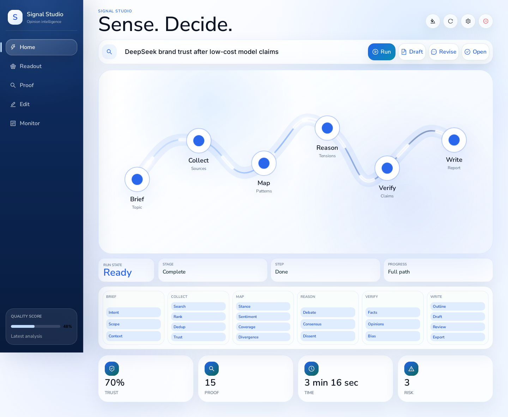
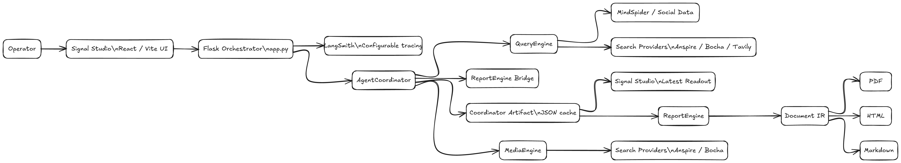
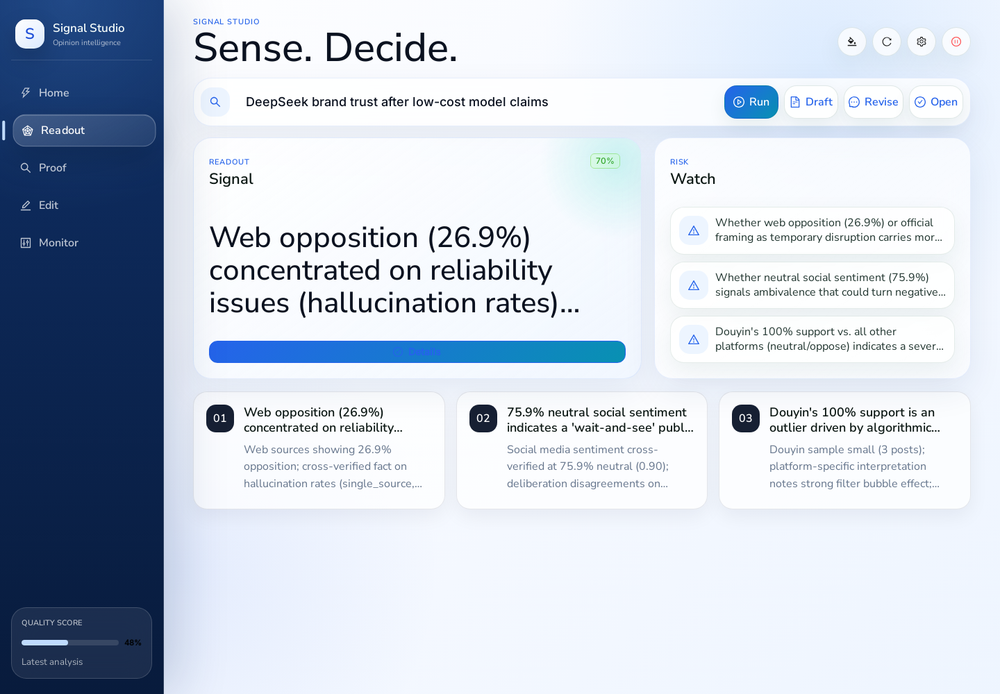

<div align="center">

# CapstoneProject

### Multi-agent public-opinion intelligence for evidence-grounded analysis and traceable reports.

<p>
  <a href="https://www.python.org/"></a>
  <a href="https://react.dev/"></a>
  <a href="https://vite.dev/"></a>
  <a href="https://flask.palletsprojects.com/"></a>
  <a href="https://langchain-ai.github.io/langgraph/"></a>
  <a href="LICENSE"></a>
</p>

<p>
  <a href="docs/README.md"><strong>Documentation</strong></a> |
  <a href="docs/operations/setup.md"><strong>Quick Start</strong></a> |
  <a href="docs/operations/artifact-review.md"><strong>Artifact Review</strong></a> |
  <a href="docs/architecture/system-architecture.md"><strong>Architecture</strong></a> |
  <a href="docs/reference/api.md"><strong>API</strong></a> |
  <a href="docs/presentation/acceptance-walkthrough.md"><strong>Walkthrough</strong></a>
</p>

</div>

CapstoneProject is an end-to-end system for public-opinion analysis. It gathers web, media, and social evidence; compares stance and trust signals; detects divergence, blind spots, and echo-chamber signals; then turns the analysis into editable, exportable reports through **Signal Studio**.

<p align="center">
  
</p>

## Positioning

| Reference Point | Known For | This Project Adds |
| --- | --- | --- |
| [RAG](https://arxiv.org/abs/2005.11401) | Retrieve, then generate. | Stance, trust, divergence, proof view. |
| [Microsoft GraphRAG](https://microsoft.github.io/graphrag/) | Graph reasoning over corpora. | Live public-opinion workflow and exports. |
| [AutoGen](https://microsoft.github.io/autogen/stable/index.html) / [CrewAI](https://github.com/crewaiinc/crewai) | Generic multi-agent orchestration. | Domain agents with a stable Coordinator artifact. |
| Sentiment classifiers | Labels and scores. | Investigation, synthesis, and reports. |
| BI/static dashboards | Visualization. | Run, refine, edit, monitor, export. |

Core strengths: multi-agent evidence analysis, inspectable reasoning, structured report IR, Signal Studio UI, OpenAPI contracts, and acceptance-ready docs. See [Contribution And Novelty](docs/presentation/contribution-and-novelty.md).

## Product Flow

| Stage | User Experience | Main System Path |
| --- | --- | --- |
| Brief | Enter a topic and start analysis. | Signal Studio -> Flask -> AgentCoordinator |
| Evidence | Inspect source mix, stance, trust, divergence, and platform readings. | QueryEngine, MediaEngine, MindSpider |
| Reasoning | Review synthesis, tensions, confidence, and recommended follow-up. | Coordinator graph |
| Report | Generate, edit, annotate, and export a polished report. | ReportEngine -> Document IR -> renderers |
| Operate | Adjust providers, start runtime, inspect traces, and send feedback. | Flask runtime APIs, configurable LangSmith traces |

<p align="center">
  
</p>

## Architecture At A Glance

| Layer | Responsibility | Primary Paths |
| --- | --- | --- |
| Interface | Signal Studio views, report editor, evidence review, runtime controls | `frontend/`, `templates/index.html`, `static/signal-studio/` |
| API gateway | Flask routes, background tasks, config editing, static shell, observability | `app.py` |
| Coordination | Parallel agent execution, divergence, deliberation, synthesis, artifact export | `AgentCoordinator/` |
| Evidence engines | Query planning, search, stance, trust, social enrichment, media research | `QueryEngine/`, `MediaEngine/`, `MindSpider/` |
| Reporting | Template selection, chapter generation, Document IR, HTML/MD/PDF export | `ReportEngine/` |
| Quality | Regression tests, provider evaluation, sanitization, schema validation | `tests/`, `api_evaluation/` |

## Interface Preview

| Readout | Proof | Report Editing |
| --- | --- | --- |
|  |  |  |

More screenshots: [Signal Studio Screenshots](docs/overview/screenshots.md).

## Quick Start

Use Python 3.11 or newer. If `python` is not on `PATH`, use Conda or the `uv` commands shown in the full [Setup Guide](docs/operations/setup.md).

```powershell
python -m venv .venv
.\.venv\Scripts\Activate.ps1
python -m pip install --upgrade pip
pip install -r requirements.txt
python -m playwright install chromium
Copy-Item .env.example .env
```

Configure provider keys in `.env`, then build the final UI:

```powershell
cd frontend
npm install
npm run build
cd ..
```

Start the Flask runtime:

```powershell
python app.py
```

`uv` equivalent:

```powershell
uv run --with-requirements requirements.txt python app.py
```

Open:

```text
http://127.0.0.1:5000
```

For the complete setup path, provider profile, artifact review path, and verification checklist, use the [Setup Guide](docs/operations/setup.md).

## Core API Surface

| Endpoint | Purpose |
| --- | --- |
| `GET /api/system/status` | Read final runtime status. |
| `POST /api/system/start` | Initialize runtime components. |
| `GET /api/config` / `POST /api/config` | Read or persist selected runtime settings. |
| `POST /api/coordinator/run` | Start integrated multi-agent analysis. |
| `GET /api/coordinator/task/{task_id}` | Poll Coordinator task state. |
| `GET /api/coordinator/latest` | Load the newest Coordinator artifact. |
| `POST /api/report/generate` | Start report generation from current analysis. |
| `GET /api/report/stream/{task_id}` | Stream report-generation progress with SSE. |
| `GET /api/report/export/pdf/{task_id}` | Export generated report as PDF. |

References:

- [API Reference](docs/reference/api.md)
- [OpenAPI YAML](docs/reference/openapi.yaml)
- [Coordinator Output Schema](docs/reference/coordinator-output-schema.md)
- [Report IR](docs/reference/report-ir.md)

## Documentation

| Start Here | Use It For |
| --- | --- |
| [Documentation Home](docs/README.md) | Full documentation map. |
| [Project Brief](docs/overview/project-brief.md) | Product scope and system purpose. |
| [Capabilities](docs/overview/capabilities.md) | What the system does and where each capability lives. |
| [System Architecture](docs/architecture/system-architecture.md) | Main components, decisions, and runtime structure. |
| [Runtime Flow](docs/architecture/runtime-flow.md) | Endpoint-level execution path. |
| [Setup](docs/operations/setup.md) | Local environment and first run. |
| [Artifact Review](docs/operations/artifact-review.md) | Review cached artifacts, screenshots, and report examples. |
| [Runbook](docs/operations/runbook.md) | Routine operation and diagnostics. |
| [Testing](docs/quality/testing.md) | Verification commands and coverage. |
| [Evidence Dashboard](docs/quality/evidence-dashboard.md) | Provider benchmark, regression evidence, and review proof points. |
| [Defense Brief](docs/presentation/defense-brief.md) | Concise technical narrative for review or defense. |
| [Contribution And Novelty](docs/presentation/contribution-and-novelty.md) | Contribution map, baseline comparison, and defense talking points. |
| [Roadmap](docs/project-roadmap.md) | Completed scope and engineering evolution plan. |

## Repository Map

```text
CapstoneProject/
|-- app.py                    # Flask orchestrator and final runtime API gateway
|-- frontend/                 # Signal Studio React/Vite source
|-- AgentCoordinator/         # Integrated multi-agent reasoning graph
|-- QueryEngine/              # Search, trust, stance, social enrichment
|-- MediaEngine/              # Media-side research and report contribution
|-- ReportEngine/             # Report generation graph, IR, renderers, exports
|-- ForumEngine/              # Forum-style coordination utilities
|-- SentimentAnalysisModel/   # Sentiment and topic model assets
|-- api_evaluation/           # Provider benchmark harness and results
|-- tests/                    # Regression and contract tests
`-- docs/                     # Authoritative documentation library
```

## Quality And Operations

| Area | Document |
| --- | --- |
| Test coverage and commands | [Testing](docs/quality/testing.md) |
| API provider benchmark | [API Evaluation](docs/quality/api-evaluation.md) |
| Evidence summary | [Evidence Dashboard](docs/quality/evidence-dashboard.md) |
| Security and sensitive input handling | [Security And Safety](docs/quality/security-and-safety.md) |
| Deployment shape | [Deployment](docs/operations/deployment.md) |
| Troubleshooting | [Troubleshooting](docs/operations/troubleshooting.md) |
| Data/model asset policy | [Data And Model Assets](docs/reference/data-and-model-assets.md) |
| Contribution guide | [CONTRIBUTING](CONTRIBUTING.md) |

## License

This repository is distributed under the [GNU General Public License v2.0](LICENSE).

## Project Status

The main application path is the Flask-served Signal Studio runtime. The authoritative project documentation is in [docs/](docs/README.md), with runtime asset boundaries documented in [Runtime Assets](docs/reference/runtime-assets.md).
