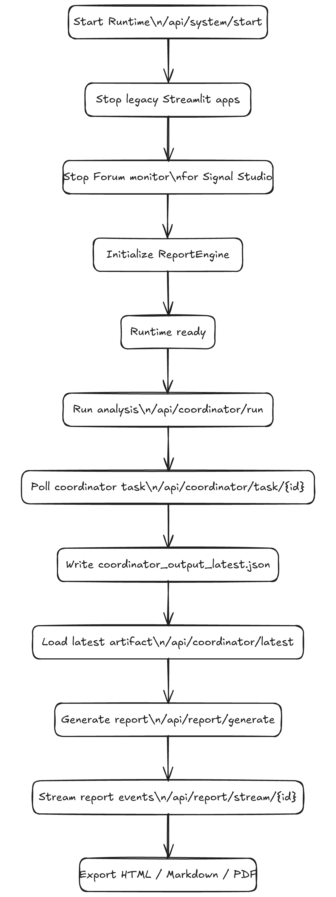
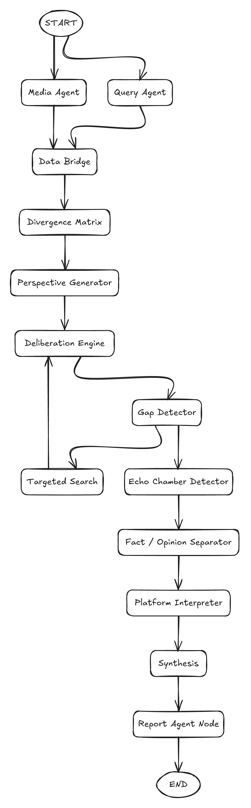
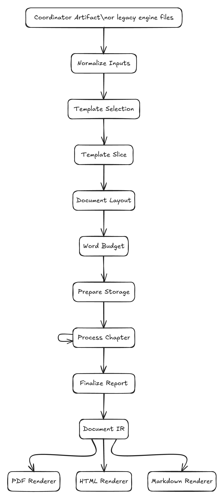
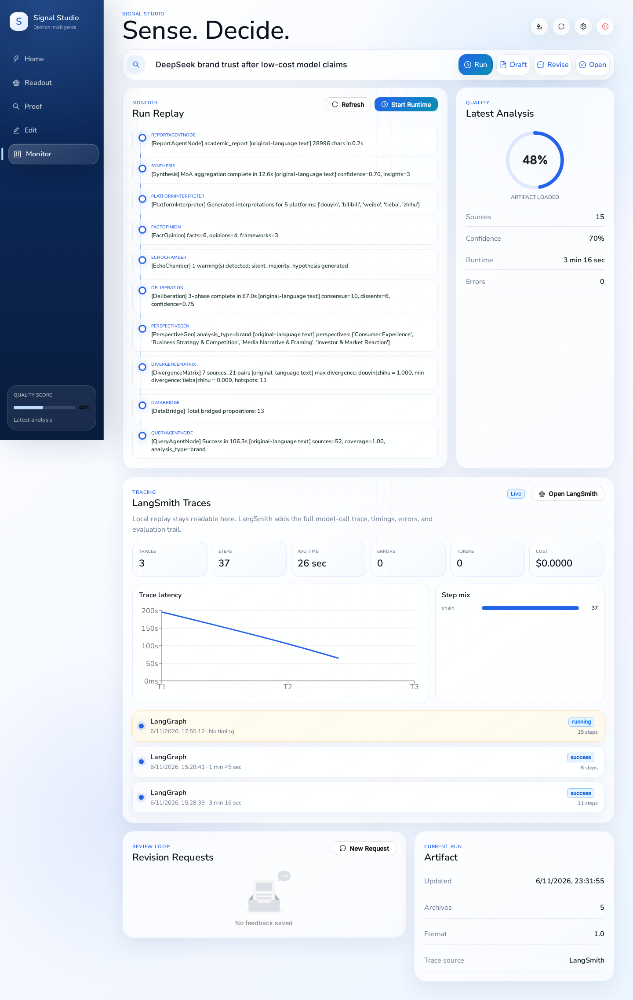

# Documentation Home

This is the authoritative documentation library for CapstoneProject: product overview, architecture, component internals, API contracts, operations, quality, and defense material.

  

## Start By Role

| Role | First Documents | Outcome |
| --- | --- | --- |
| New reader | [Project Brief](overview/project-brief.md), [Capabilities](overview/capabilities.md), [Screenshots](overview/screenshots.md) | Understand what the system does and why it exists. |
| Developer | [Repository Map](overview/repository-map.md), [System Architecture](architecture/system-architecture.md), [Runtime Flow](architecture/runtime-flow.md) | Locate the right subsystem and understand the execution path. |
| API integrator | [API Reference](reference/api.md), [OpenAPI YAML](reference/openapi.yaml), [Coordinator Output Schema](reference/coordinator-output-schema.md) | Use the runtime contracts without reading implementation code first. |
| Operator | [Setup](operations/setup.md), [Runbook](operations/runbook.md), [Troubleshooting](operations/troubleshooting.md) | Start, run, diagnose, and recover the system. |
| Reviewer | [Artifact Review](operations/artifact-review.md), [Screenshots](overview/screenshots.md), [Defense Brief](presentation/defense-brief.md) | Review the UI, cached artifacts, report examples, and technical evidence. |
| Defense committee | [Defense Brief](presentation/defense-brief.md), [Acceptance Walkthrough](presentation/acceptance-walkthrough.md), [Assessment Matrix](presentation/assessment-matrix.md) | Evaluate the system narrative, acceptance path, and technical coverage. |

## Documentation Map

| Area | Documents | Use When |
| --- | --- | --- |
| Overview | [Project Brief](overview/project-brief.md), [Capabilities](overview/capabilities.md), [Repository Map](overview/repository-map.md), [Screenshots](overview/screenshots.md) | You need the product scope, concepts, file layout, or UI visuals. |
| Architecture | [System Architecture](architecture/system-architecture.md), [Runtime Flow](architecture/runtime-flow.md), [Data Artifacts](architecture/data-artifacts.md), [Quality Attributes](architecture/quality-attributes.md) | You need system design, graph flow, data movement, or architecture tradeoffs. |
| Components | [Signal Studio](components/signal-studio.md), [Flask Orchestrator](components/flask-orchestrator.md), [QueryEngine](components/query-engine.md), [MediaEngine](components/media-engine.md), [AgentCoordinator](components/agent-coordinator.md), [ReportEngine](components/report-engine.md), [ForumEngine](components/forum-engine.md), [Sentiment Models](components/sentiment-models.md) | You are working on one subsystem. |
| Reference | [API Reference](reference/api.md), [OpenAPI YAML](reference/openapi.yaml), [Configuration](reference/configuration.md), [Coordinator Output Schema](reference/coordinator-output-schema.md), [Report IR](reference/report-ir.md), [Runtime Assets](reference/runtime-assets.md), [Data And Model Assets](reference/data-and-model-assets.md) | You need exact contracts, settings, schemas, asset paths, or data/model publication rules. |
| Operations | [Setup](operations/setup.md), [Artifact Review](operations/artifact-review.md), [Runbook](operations/runbook.md), [Deployment](operations/deployment.md), [Troubleshooting](operations/troubleshooting.md) | You need to run, deploy, review artifacts, or diagnose the system. |
| Quality | [Evidence Dashboard](quality/evidence-dashboard.md), [Testing](quality/testing.md), [API Evaluation](quality/api-evaluation.md), [Security And Safety](quality/security-and-safety.md) | You need verification evidence, test coverage, provider evaluation, or safety constraints. |
| Presentation | [Defense Brief](presentation/defense-brief.md), [Contribution And Novelty](presentation/contribution-and-novelty.md), [Acceptance Walkthrough](presentation/acceptance-walkthrough.md), [Assessment Matrix](presentation/assessment-matrix.md) | You need a concise technical narrative for review, defense, or handoff. |
| Project management | [Roadmap](project-roadmap.md), [Maintenance](maintenance.md), [Contributing](../CONTRIBUTING.md) | You need engineering evolution, documentation checks, or contribution rules. |

## System At A Glance

| Layer | Responsibility | Primary Paths |
| --- | --- | --- |
| Interface | Signal Studio analysis, evidence, report editing, monitoring, configuration | `frontend/`, `templates/index.html`, `static/signal-studio/` |
| Orchestration | Flask API surface, runtime state, config editing, background tasks, Socket.IO | `app.py` |
| Reasoning | Query/Media fan-out, divergence analysis, deliberation, synthesis | `AgentCoordinator/` |
| Evidence | Search providers, trust scoring, stance classification, social enrichment | `QueryEngine/`, `MediaEngine/`, `MindSpider/` |
| Reporting | Coordinator bridge, report planning, Document IR, renderers | `ReportEngine/` |
| Quality | Regression tests, API provider benchmark, output validation | `tests/`, `api_evaluation/`, `QueryEngine/evaluation/` |

## Key Visuals

| Diagram | Purpose |
| --- | --- |
|  | Runtime path across Signal Studio, Flask, Coordinator, engines, and ReportEngine. |
|  | AgentCoordinator graph from engine fan-out through synthesis and report handoff. |
|  | ReportEngine planning, chapter generation, finalization, and export pipeline. |

All diagram sources are versioned under `docs/assets/diagrams/source/`; exported PNGs are under `docs/assets/diagrams/exported/`.

## Interface Preview

| Home | Proof | Monitor |
| --- | --- | --- |
|  |  |  |

Full gallery: [Signal Studio Screenshots](overview/screenshots.md).

## Documentation Principles

| Principle | Project Application |
| --- | --- |
| Separate task, reference, and explanation | Setup, API contracts, component internals, and design rationale live in different documents. |
| Prefer diagrams and tables | The library uses Excalidraw diagrams and tables for scanability. |
| Source facts from implementation | Endpoint, schema, runtime, and graph documentation is based on the current repository implementation. |
| Keep runtime assets distinct | Runtime templates and generated outputs are documented, not folded into the docs navigation. |

## Important Boundaries

Some Markdown files outside `docs/` are runtime assets rather than project documentation:

| Asset Class | Why It Remains Outside `docs/` |
| --- | --- |
| Report templates under `ReportEngine/report_template/` | Loaded by `ReportEngine` through `TEMPLATE_DIR`; moving them would change runtime behavior. |
| Generated sample reports under `static/` or cache folders | Output artifacts, not source documentation. |
| Local tool state under `.serena/` | Assistant/tool memory, not project documentation. |

For the public project documentation surface, use this library and the root [README](../README.md).
