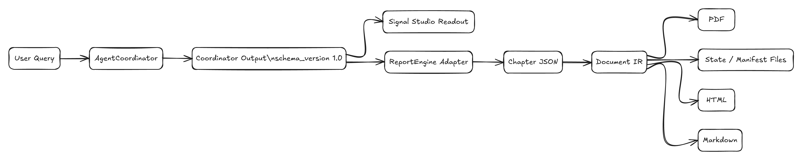

# Data Artifacts

The system uses local artifacts to decouple long-running analysis, UI inspection, and report generation.

The key point is that `coordinator_output_latest.json` is both a UI contract and a ReportEngine input. This keeps the proof view, monitor view, and report generator aligned around one persisted analysis artifact. Full-size diagram: [`docs/assets/diagrams/exported/artifact-flow.png`](../assets/diagrams/exported/artifact-flow.png).

## Artifact Inventory

| Artifact | Path | Producer | Consumer | Purpose |
| --- | --- | --- | --- | --- |
| Latest Coordinator output | `AgentCoordinator/cache/coordinator_output_latest.json` | `AgentCoordinator._export_coordinator_output()` | Signal Studio, ReportEngine bridge | Stable latest `2.1-coordinator-intelligence` analysis contract. |
| Timestamped Coordinator output | `AgentCoordinator/cache/coordinator_output_<timestamp>.json` | AgentCoordinator | Archive/review | Preserves run history. |
| Frontend feedback log | `AgentCoordinator/cache/frontend_feedback.jsonl` | `/api/coordinator/feedback` | Signal Studio Monitor | Stores review/revision requests. |
| Report HTML | `output/` | ReportEngine | Browser/download | Final rendered report. |
| Document IR | `output/document_ir/` | ReportEngine | Markdown/PDF renderers, diagnostics | Renderer-independent report representation. |
| Chapter JSON | `output/chapters/` | ReportEngine chapter loop | Finalizer/diagnostics | Per-chapter generation output. |
| JSON error logs | `output/json_error_logs/` | ReportEngine repair flow | Engineers | Debugging malformed LLM output. |
| Report log | `logs/report.log` | ReportEngine log sink | `/api/report/log` | Report-generation trace. |
| Legacy app logs | `logs/*.log` | Streamlit/Forum legacy processes | Legacy UI APIs | Diagnostics for compatibility surfaces. |

## Coordinator Output Contract

The Coordinator artifact is the main system boundary between analysis and presentation.

| Field | Description |
| --- | --- |
| `schema_version` | Current artifact schema version, currently `2.1-coordinator-intelligence`. |
| `artifact_derivation` | Identifies `coordinator_intelligence` as the primary record and compatibility sections as derived views. |
| `coordinator_intelligence` | EvidenceGraph ledger with normalized items, quality features, clusters, claims, audit decisions, cited insights, provider diagnostics, source coverage, and trace. |
| `query` | Analysis query after request normalization. |
| `analysis_type` | Planner-derived analysis type. |
| `generated_at` | UTC timestamp. |
| `pipeline_duration_seconds` | End-to-end Coordinator runtime. |
| `divergence_matrix` | Pairwise disagreement values, hotspots, max/min divergence derived from evidence groups. |
| `deliberation` | Compatibility view over claim-level audit, contradiction edges, consensus, dissent, and confidence. |
| `gap_filling` | Adaptive follow-up retrieval tasks and result count. |
| `platform_interpretations` | Platform-specific reading text when observable platform samples exist. |
| `bias_analysis` | Echo warnings and silent-majority boundary statement. |
| `fact_opinion_separation` | Facts, opinion observations, and analytical frameworks. |
| `synthesis` | Cited insights, key tensions, confidence, and follow-up. |
| `source_data` | QueryAgent/MediaAgent compatibility summary derived from the EvidenceGraph. |
| `coordinator_trace` | Local trace messages for Monitor replay. |
| `agent_errors` | Diagnostic messages captured during provider/runtime execution. |

Full details: [Coordinator Output Schema](../reference/coordinator-output-schema.md).

## Document IR Contract

ReportEngine does not render directly from raw LLM prose. It generates and validates a structured Document IR:

| IR Layer | Content |
| --- | --- |
| Document metadata | Topic, title, timestamps, theme and layout information. |
| Chapters | Ordered chapter JSON generated by the graph loop. |
| Blocks | `heading`, `paragraph`, `table`, `swotTable`, `pestTable`, `engineQuote`, `widget`, and other supported blocks. |
| Rendered outputs | HTML, Markdown, PDF. |

Full details: [Report IR](../reference/report-ir.md).

## State Management Notes

| Concern | Behavior |
| --- | --- |
| Latest result | Overwritten on every successful Coordinator run. |
| Archive retention | Timestamped Coordinator artifacts accumulate in `AgentCoordinator/cache/`. |
| Report task history | In-memory registry keeps limited task history; generated files remain on disk. |
| Server restart | In-memory task state is lost; persisted artifacts can still be loaded. |
| Versioning | Coordinator artifact has `schema_version`; Report IR uses `IR_VERSION`. |
