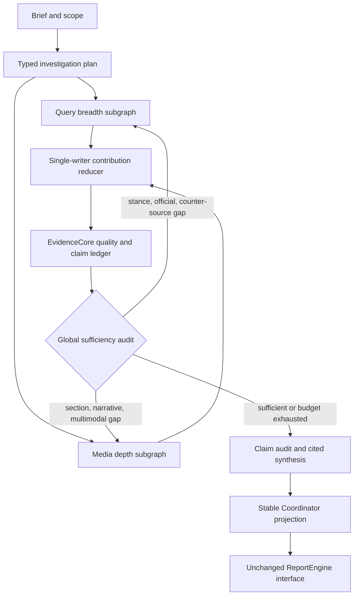

# Query/Media Evidence Fusion Architecture

## Problem

The earlier Coordinator graph did execute QueryAgent and MediaAgent, but its DataBridge flattened Query structures and Media Markdown into proposition strings. The later intelligence path improved evidence contracts and auditability but bypassed both specialist graphs and reimplemented their responsibilities inside one runtime.

The fusion architecture keeps the useful specialist loops without restoring the lossy bridge or creating another all-owning engine.

## Ownership

| Owner | Responsibilities | Must Not Own |
| --- | --- | --- |
| Parent `FusionCoordinator` | Scope, typed tasks, budgets, parallel fan-out, global follow-up routing, stopping, checkpoint namespace, final projection | Source truth, paragraph prose, ReportEngine rendering |
| QueryEngine | Stance-aware breadth, official/support/oppose/neutral coverage, multi-source retrieval, counter-source discovery, social enrichment | Final conclusions, cross-agent deduplication |
| MediaEngine | Narrative structure, paragraph research, reflection, media frames, multimodal observations, section dossiers | Final report rendering, canonical claim status |
| EvidenceCore | Canonical sources, acquisition provenance, quality, deduplication, source spans, claim merge, support/contradiction relations, audit | Specialist search planning, report templates |
| ReportEngine | Template selection, chapters, Document IR, editing, HTML/Markdown/PDF | Retrieval, source quality, claim adjudication |

## Active Flow

The initial Query and Media tasks execute concurrently. Parallel specialists never mutate shared evidence directly. They submit complete contribution batches, and one reducer advances the blackboard version.

## Contracts

| Contract | Purpose |
| --- | --- |
| `ResearchTask` | Objective, specialist, query, task type, required stance/source scope, round, output contract, and budget |
| `QueryContribution` | Query sources, discoveries, excerpts, claim proposals, stance coverage, gaps, social context, trace, and errors |
| `MediaContribution` | Media sources, discoveries, excerpts, section dossiers, assets, narrative state, trace, and errors |
| `EvidenceCandidate` | Source-shaped input before canonical ingest |
| `AcquisitionObservation` | One agent/task/query/provider discovery of a source |
| `EvidenceSpan` | Specialist-proposed addressable excerpt or multimodal locator |
| `ClaimProposal` | Specialist claim candidate that cannot become a claim without bound evidence |
| `Claim` | Canonical audited claim used by final synthesis |
| `EvidenceRelationEdge` | Evidence-bound support/proposal relation |
| `ContradictionEdge` | Claim-to-claim disagreement requiring retained counter-evidence or follow-up |
| `CoverageAssessment` | Specialist-specific covered and missing dimensions |
| `SectionDossier` | Media section objective, summary, source/span refs, assets, reflection count, and unresolved questions |
| `AgentRunRecord` | Task status, elapsed time, source count, errors, and instrumentation slots |

## Blackboard Invariants

1. A canonical source is not an acquisition event.
2. The same URL discovered by two agents produces one source and two observations.
3. Tracking parameters and fragments do not create new sources.
4. A later specialist can enrich an existing source with longer text or missing publication metadata; the enrichment advances the event version.
5. Contribution ingest is idempotent by contribution id.
6. Observations and spans cannot reference a source absent from their contribution.
7. A claim proposal without an EvidenceCore-bound source span is not admitted to the claim ledger.
8. Specialist Markdown or dossier prose cannot directly become a final conclusion.
9. Only audited claims with citations can become final insights.

## Control Plane And Data Plane

LangGraph state stores control-plane data only: run id, blackboard/core versions, counts, evidence summary, typed tasks, diagnostics, trace, and artifact reference. Source bodies, pending contribution batches, blackboard entities, and core snapshots live in run-scoped supervisor repositories.

This avoids copying large evidence bodies through every checkpoint. The current checkpointer is in-memory and run-scoped; durable cross-process recovery would require a persistent checkpointer plus a persistent blackboard repository.

## Follow-Up Routing

| Gap | Route | Example Output Contract |
| --- | --- | --- |
| Missing official/support/oppose/neutral stance | QueryEngine | `QueryContribution` |
| One-sided or high-copy claim | QueryEngine counter-source task | `QueryContribution` |
| Missing official evidence for a high-value claim | QueryEngine primary-source task | `QueryContribution` |
| Incomplete section dossier | MediaEngine | `MediaContribution` |
| Missing narrative or multimodal context | MediaEngine | `MediaContribution` |

The global loop is bounded by `COORDINATOR_MAX_RESEARCH_ROUNDS`, per-agent deadlines, source caps, and a maximum number of follow-up tasks per round. API/LLM call counters are explicit instrumentation fields but are not claimed as measured until server instrumentation is enabled.

## MindSpider

MindSpider is a QueryEngine source, not a peer reasoning agent. Read-only use requires `COORDINATOR_ENABLE_MINDSPIDER_DB=true`. Starting BroadTopicExtraction requires the separate `COORDINATOR_ALLOW_MINDSPIDER_CRAWL_TRIGGER=true`; it is false by default.

Rows without a public URL receive a stable content/time-based pseudo-URI. Source table, source keyword, task query, provider, and retrieval time remain visible in the source candidate and acquisition observation.

See [MindSpider Data Contract](../reference/mindspider-data-contract.md).

## Failure Semantics

| Failure | Behavior |
| --- | --- |
| One specialist fails | Record failed `AgentRunRecord` and provider diagnostic; reduce the other contribution without claiming both ran |
| Specialist returns internal errors and usable data | Mark the run/contribution `partial`; retain errors and evidence |
| Contribution violates identity or source-reference contract | Reject the batch before blackboard ingest |
| Deadline exceeded | Record task failure; do not silently rerun the entire Coordinator operation |
| Optional semantic provider missing | Use deterministic quality rules and record the limitation |
| Artifact write interrupted | Write to a temporary file, flush/fsync, then atomically replace the target |

## Compatibility Boundary

The following remain stable:

- `POST /api/coordinator/run`
- `GET /api/coordinator/latest`
- `coordinator_output_latest.json`
- top-level schema `2.1-coordinator-intelligence`
- `coordinator_output_to_report_engine_inputs()`
- ReportEngine `generate_report()` call shape

New evidence, observations, tasks, dossiers, and run records are additive inside `coordinator_intelligence`. The compatibility `source_data.media_agent` view now exposes actual dossier summaries so the unchanged ReportEngine input can consume Media depth.

## Evaluation Boundary

Implementation and contract tests do not establish superiority. Server experiments must compare the same topic set under:

1. Query-only.
2. Media-only.
3. Previous intelligence path.
4. Fused Query/Media path.

Required measurements include citation validity, factual correctness, stance/source coverage, contradiction recall, dossier usefulness, latency, provider calls, cost where available, partial-failure behavior, and qualitative error cases. `AgentCoordinator/fusion/evaluation.py` defines the record shape and leaves human scores unset until those experiments run.
