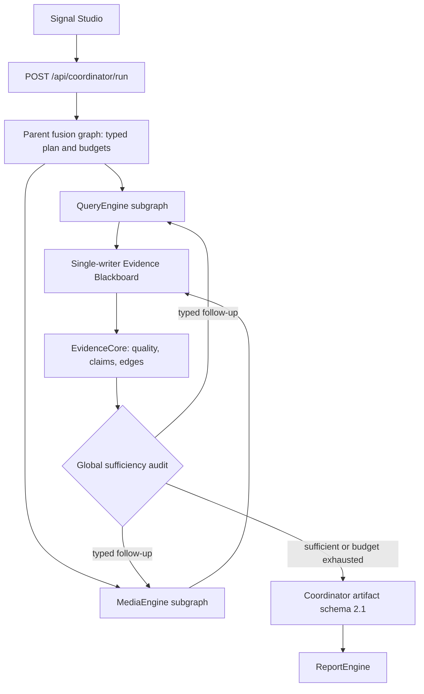

# Runtime Flow

The final runtime path starts with Signal Studio and uses Flask as the unified operator/API boundary. `initialize_system_components()` stops compatibility Streamlit apps and the Forum monitor before initializing ReportEngine.

The Mermaid diagram and [`final-runtime.dsl`](../assets/diagrams/source/final-runtime.dsl) are authoritative for the current fusion path. The previously exported PNG predates this implementation and must be regenerated before it is used in a defense deck.

## Startup Flow

| Step | Component | Behavior |
| --- | --- | --- |
| 1 | Browser | Opens `/`, which renders `templates/index.html`. |
| 2 | Signal Studio | Loads JS/CSS from `/static/signal-studio/assets/`. |
| 3 | UI status hook | Calls `/api/system/status`, `/api/report/status`, and `/api/config`. |
| 4 | Operator or config drawer | Calls `POST /api/system/start`. |
| 5 | Flask | Stops legacy Streamlit apps listed in `STREAMLIT_SCRIPTS`. |
| 6 | Flask | Stops ForumEngine monitor for final Signal Studio mode. |
| 7 | Flask | Initializes ReportEngine through `initialize_report_engine()`. |
| 8 | UI | Shows runtime as ready. |

## Analysis Flow

| Step | Endpoint Or Module | Contract |
| --- | --- | --- |
| 1 | `POST /api/coordinator/run` | Body contains `query` and reviewer feedback when refinement is requested. |
| 2 | Flask task registry | Creates `coord_<timestamp>_<suffix>` task with queued/running/completed/error state. |
| 3 | `_run_coordinator_task()` | Runs `AgentCoordinator.run_sync()` in a background thread. |
| 4 | AgentCoordinator | Plans typed Query/Media tasks and runs both specialist subgraphs in parallel. |
| 5 | Evidence reducer | Canonicalizes sources while preserving every acquisition observation, then builds quality features and the claim ledger. |
| 6 | Global audit loop | Routes bounded follow-ups to Query or Media and performs final evidence-bound audit/synthesis. |
| 7 | Artifact export | Writes timestamped and latest Coordinator JSON files. |
| 8 | `GET /api/coordinator/task/{task_id}` | UI polls until `completed` or `error`. |
| 9 | `GET /api/coordinator/latest` | UI loads output, metadata, feedback, and observability settings. |

## Report Flow

| Step | Endpoint Or Module | Contract |
| --- | --- | --- |
| 1 | `POST /api/report/generate` | Starts a ReportTask with `query` and template override when provided. |
| 2 | Input selection | Uses the Coordinator artifact contract or engine files as the analysis source. |
| 3 | Background task | Runs `ReportAgent.generate_report()` through `run_report_generation*`. |
| 4 | `GET /api/report/stream/{task_id}` | UI subscribes to Server-Sent Events. |
| 5 | ReportEngine graph | Selects template, slices chapters, plans layout and word budget, processes chapters, finalizes report. |
| 6 | Document IR | Saved under output paths configured by `config.py`. |
| 7 | Renderers | Produce HTML, Markdown, and PDF exports. |
| 8 | UI editor | Fetches `/api/report/result/{task_id}/json`, loads HTML and Document IR, and re-renders edited IR through ReportEngine. |

## Feedback Flow

| Step | Endpoint | Behavior |
| --- | --- | --- |
| 1 | `POST /api/coordinator/feedback` | Saves target/action/priority/free-text feedback to JSONL. |
| 2 | Signal Studio | Can save only or save and run refinement. |
| 3 | `POST /api/coordinator/run` | When run-after-save is selected, feedback text is sent with the new analysis request. |
| 4 | `GET /api/coordinator/latest` | Monitor shows saved feedback records and summary. |

## Observability Flow

| Source | Behavior |
| --- | --- |
| Local fusion trace | Stores planning, specialist fan-out, blackboard reduction, sufficiency routing, and final audit nodes in the Coordinator artifact. |
| LangSmith configured | `/api/observability/langsmith` loads recent root runs and child runs. |
| Local trace mode | API returns local Coordinator trace data for Monitor replay. |

## Legacy Runtime Surfaces

| Surface | Endpoint Examples | Status |
| --- | --- | --- |
| Streamlit app controls | `/api/start/{app_name}`, `/api/stop/{app_name}`, `/api/status`, `/api/output/{app_name}` | Preserved for compatibility and diagnostics. |
| Forum monitor | `/api/forum/start`, `/api/forum/stop`, `/api/forum/log` | Compatibility monitor around the final Signal Studio path. |
| Socket.IO status | `connect`, `request_status` | Still available for legacy status updates. |
