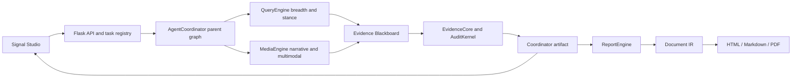

# System Architecture

CapstoneProject uses a layered architecture: Signal Studio provides the operator surface, Flask provides the runtime/API boundary, AgentCoordinator supervises active QueryEngine and MediaEngine subgraphs, a shared Evidence Blackboard owns canonical evidence and audit state, and ReportEngine converts the projected Coordinator artifact into publication-ready output.

The Mermaid diagram and [`system-context.dsl`](../assets/diagrams/source/system-context.dsl) are authoritative. The previously exported PNG predates the fusion implementation and should not be used as proof of the current activate path until regenerated.

## Architectural Layers

| Layer | Responsibility | Primary Implementation |
| --- | --- | --- |
| Interface | Topic entry, analysis status, readout, evidence review, report editing, monitoring, configuration | `frontend/`, `templates/index.html`, `static/signal-studio/` |
| API gateway | HTTP APIs, background task management, config read/write, runtime state, static shell | `app.py` |
| Agent orchestration | Typed task planning, parallel specialist execution, global routing, checkpoint namespace, progress, artifact export | `AgentCoordinator/fusion/`, `AgentCoordinator/coordinator.py` |
| Evidence ownership | Append-only acquisitions, canonical sources, quality modeling, claim merge, audit, citation synthesis | `AgentCoordinator/intelligence/evidence_core/` |
| Specialist engines | Query breadth/stance/MindSpider retrieval and Media narrative/multimodal dossiers | `QueryEngine/`, `MediaEngine/`, `MindSpider/` |
| Report generation | Template selection, chapter generation, Document IR, renderers, export APIs | `ReportEngine/` |
| Observability and quality | Local traces, LangSmith traces, tests, provider evaluation | `app.py`, `tests/`, `api_evaluation/` |

## Main Runtime Path

| Step | Action | System Boundary |
| --- | --- | --- |
| 1 | Operator enters a topic in Signal Studio. | Browser -> Flask |
| 2 | `POST /api/coordinator/run` creates a background Coordinator task. | Flask -> AgentCoordinator |
| 3 | AgentCoordinator delegates typed tasks to QueryEngine and MediaEngine subgraphs in parallel. | Parent graph -> specialists |
| 4 | One reducer ingests contributions into the Evidence Blackboard; EvidenceCore builds quality, claims, relations, and audit decisions. | Specialists -> EvidenceCore |
| 5 | Coordinator writes `coordinator_output_latest.json`. | Local artifact |
| 6 | Signal Studio loads `/api/coordinator/latest`. | Flask -> browser |
| 7 | Operator starts report generation through `/api/report/generate`. | Browser -> ReportEngine Blueprint |
| 8 | ReportEngine streams progress through SSE and writes HTML/IR/state outputs. | ReportEngine -> browser/local disk |
| 9 | Operator edits, annotates, and exports HTML, Markdown, or PDF. | Browser -> ReportEngine export endpoints |

See [Runtime Flow](runtime-flow.md) for endpoint-level detail.

See [Query/Media Evidence Fusion](query-media-evidence-fusion.md) for contracts, invariants, routing, and failure semantics.

## Key Design Decisions

| Decision | Reason | Tradeoff |
| --- | --- | --- |
| Use Flask as the unified runtime gateway | Existing backend is Python-centric and already integrates ReportEngine, Coordinator, config, and static UI serving. | Long-running jobs require explicit background task and polling/SSE handling. |
| Use a hierarchical supervisor plus Evidence Blackboard | Query keeps breadth/stance expertise, Media keeps narrative/multimodal depth, and source truth has one owner. | More contracts and routing logic must be tested than in a single monolithic pipeline. |
| Persist a Coordinator artifact before report generation | Decouples analysis from report rendering and lets Signal Studio inspect the same structured output ReportEngine consumes. | Local artifact paths become part of runtime state. |
| Keep final Signal Studio mode separate from legacy Streamlit apps | Final UI is cohesive and does not use Streamlit sub-processes. | Compatibility endpoints remain documented as secondary surfaces. |
| Use Document IR for reports | Renderers can share a validated intermediate representation and support HTML/Markdown/PDF outputs. | LLM output must be repaired and validated before rendering. |

## Building Blocks

| Block | Inputs | Outputs | Operational Behavior |
| --- | --- | --- | --- |
| Signal Studio | Topic, settings, revision requests | API calls, edited report HTML, annotations | Shows API diagnostics and sensitive-input modal. |
| Flask Orchestrator | HTTP requests, config file, local artifacts | JSON responses, task state, Socket.IO events | Catches route exceptions and returns structured JSON diagnostics. |
| QueryEngine | Typed breadth task | `QueryContribution` | Runs stance planning, multi-source retrieval, coverage loop, and counter-source discovery. |
| MediaEngine | Typed depth task | `MediaContribution`, `SectionDossier` | Runs paragraph research, reflection, media framing, and multimodal source collection. |
| EvidenceCore | Specialist batches | Canonical sources, observations, quality, claims, edges, audit state | Single writer preserves provenance and prevents parallel state races. |
| AgentCoordinator | Query, reviewer feedback | Coordinator output artifact | Runs the parent graph and exports trace and analysis context. |
| ReportEngine | Coordinator artifact or engine files, template | HTML, IR, Markdown, PDF | Task status, SSE diagnostics, JSON repair, validation, renderer recovery. |

## Cross-Cutting Concerns

| Concern | Mechanism |
| --- | --- |
| Configuration | `config.py` Pydantic Settings, `.env`, `/api/config` editing. |
| Secrets | API keys are configured through environment/config values and should not be committed. |
| Sensitive input | `utils/sensitive_input_filter.py` rejects blocked request text before analysis/report generation. |
| Traceability | Coordinator trace, local artifact metadata, configurable LangSmith tracing. |
| Output language | `REPORT_OUTPUT_LANGUAGE=en` and report prompts enforce English output by default. |
| Provider selection | `api_evaluation/` compares candidate LLM/search APIs before runtime adoption. |

## Related Documents

- [Runtime Flow](runtime-flow.md)
- [Data Artifacts](data-artifacts.md)
- [Quality Attributes](quality-attributes.md)
- [AgentCoordinator](../components/agent-coordinator.md)
- [ReportEngine](../components/report-engine.md)
