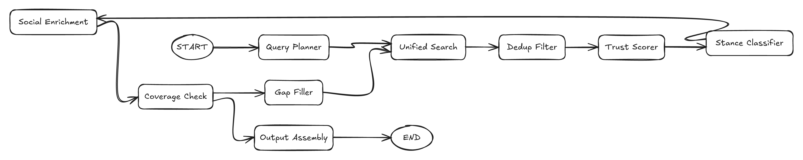

# QueryEngine

QueryEngine is the evidence retrieval and stance analysis engine. Its structured mode is used by AgentCoordinator.

The graph shows how a topic becomes stance-aware subqueries, searched sources, deduplicated evidence, trust scores, stance labels, coverage checks, and a structured output. Full-size diagram: [`docs/assets/diagrams/exported/query-agent-graph.png`](../assets/diagrams/exported/query-agent-graph.png).

## Implementation

| Path | Purpose |
| --- | --- |
| `QueryEngine/agent.py` | Agent entry points, legacy deep research, structured research. |
| `QueryEngine/graph/builder.py` | LangGraph topology. |
| `QueryEngine/graph/state.py` | TypedDict state and output contracts. |
| `QueryEngine/graph/nodes/` | Planner, search, dedup, trust, stance, enrichment, coverage, gap filling, output assembly. |
| `QueryEngine/tools/` | Search dispatching and provider integrations. |
| `QueryEngine/fusion/` | Result fusion and deduplication utilities. |
| `QueryEngine/classifiers/` | Trust and stance classifier utilities. |
| `QueryEngine/evaluation/` | QueryAgent evaluation scripts and results. |

## Structured Research Flow

| Node | Responsibility |
| --- | --- |
| `query_planner` | Generate stance-aware subqueries. |
| `unified_search` | Search across configured providers and social sources. |
| `dedup_filter` | Remove duplicate URLs/content. |
| `trust_scorer` | Score source reliability. |
| `stance_classify` | Classify sources by support/oppose/neutral/official/background/unknown. |
| `social_enrichment` | Add social sentiment/divergence information when available. |
| `coverage_check` | Determine whether stance coverage is sufficient. |
| `gap_filler` | Generate supplementary queries when coverage is weak. |
| `output_assemble` | Produce structured QueryAgent output. |

## Public Entry Points

| Method | Usage |
| --- | --- |
| `research_structured(query)` | Async structured output used by AgentCoordinator. |
| `research_structured_sync(query)` | Sync wrapper for non-async contexts. |
| `research(query, save_report=True)` | Legacy report-style deep research path. |
| `create_agent()` | Factory used by integration code. |

## Structured Output Highlights

| Field | Purpose |
| --- | --- |
| `stance_distribution` | Ratio or counts by stance class. |
| `sources` | Sorted source list with trust and stance metadata. |
| `coverage_score` | Stance/source coverage metric. |
| `knowledge_gaps` | Underrepresented perspectives. |
| `social_sentiment` | Social signal summary when enrichment is configured. |
| `trace_log`, `error_log` | Local diagnostics. |

## Provider Dependencies

| Setting | Purpose |
| --- | --- |
| `QUERY_ENGINE_API_KEY` / `BASE_URL` / `MODEL_NAME` | LLM used for QueryEngine reasoning. |
| `SEARCH_TOOL_TYPE` | Selects `AnspireAPI` or `BochaAPI`. |
| `TAVILY_API_KEY` | Tavily web search when selected. |
| `BOCHA_WEB_SEARCH_API_KEY` | Bocha search. |
| `ANSPIRE_API_KEY` | Anspire search. |
| `MINDSPIDER_*` | Social enrichment profile. |

## Related Documents

- [AgentCoordinator](agent-coordinator.md)
- [Configuration](../reference/configuration.md)
- [API Evaluation](../quality/api-evaluation.md)
