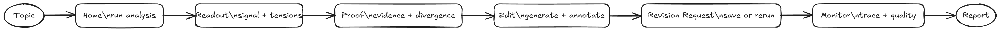

# Signal Studio

Signal Studio is the final React operator interface. It is built with Vite and served by Flask from `static/signal-studio/`.

The flow connects the five operator views to the runtime APIs they use. Open the full-size image at [`docs/assets/diagrams/exported/signal-studio-flow.png`](../assets/diagrams/exported/signal-studio-flow.png) if the wide preview is compressed.

## Implementation

| Area | Path |
| --- | --- |
| App shell | `frontend/src/App.jsx` |
| Views | `frontend/src/views/` |
| API hooks | `frontend/src/hooks/useApi.js`, `usePolling.js`, `useSSE.js` |
| Shared components | `frontend/src/components/` |
| Constants and helpers | `frontend/src/utils/` |
| Build config | `frontend/vite.config.js` |
| Served assets | `static/signal-studio/` |
| Flask page shell | `templates/index.html` |

## View Model

| View | Purpose | Key Data |
| --- | --- | --- |
| Home | Topic entry, analysis launch, high-level quality metrics | Coordinator task, latest output, confidence, source count, runtime, tension count |
| Readout | Executive synthesis, top insight, tensions, recommendations | `output.synthesis` |
| Proof | Stance mix, divergence heatmap, evidence table, platform readings | `output.source_data`, `output.divergence_matrix`, `output.platform_interpretations` |
| Edit | Report generation, rich-text editing, annotations, exports | Report task, report HTML, report SSE events |
| Monitor | Runtime controls, local trace replay, LangSmith traces, feedback, artifact metadata | System status, observability, feedback, metadata |

Screenshots: [Signal Studio Screenshots](../overview/screenshots.md).

## API Usage

| UI Action | API |
| --- | --- |
| Load latest analysis | `GET /api/coordinator/latest` |
| Start analysis | `POST /api/coordinator/run` |
| Poll analysis | `GET /api/coordinator/task/{task_id}` |
| Save feedback | `POST /api/coordinator/feedback` |
| Load system status | `GET /api/system/status` |
| Start runtime | `POST /api/system/start` |
| Shutdown runtime | `POST /api/system/shutdown` |
| Load configuration | `GET /api/config` |
| Save configuration | `POST /api/config` |
| Start report generation | `POST /api/report/generate` |
| Stream report generation | `GET /api/report/stream/{task_id}` |
| Load report HTML | `GET /api/report/result/{task_id}/json` |
| Export report | `/api/report/download/{task_id}`, `/api/report/export/md/{task_id}`, `/api/report/export/pdf/{task_id}` |
| Load traces | `GET /api/observability/langsmith` |

## Build And Serve

| Command | Effect |
| --- | --- |
| `cd frontend && npm run dev` | Runs Vite dev server with `/api` proxy to Flask. |
| `cd frontend && npm run build` | Writes production assets to `static/signal-studio/`. |
| `python app.py` | Serves `templates/index.html`, which loads built Signal Studio assets. |
| `uv run --python 3.11 --with-requirements requirements.txt python app.py` | Same backend start path without relying on `python` being on `PATH`. |

The Vite config uses:

| Setting | Value |
| --- | --- |
| `base` | `/static/signal-studio/` |
| `build.outDir` | `../static/signal-studio` |
| entry file | `assets/app.js` |
| proxy | `/api -> http://127.0.0.1:5000` in development |

## UX Contracts

| Contract | Implementation |
| --- | --- |
| Sensitive input handling | `isSensitiveInputError()` and `showSensitiveInputModal()` show a blocking modal. |
| Coordinator progress | `usePolling()` checks task state every 1.8 seconds. |
| Report progress | `useSSE()` subscribes to report events and fetches final HTML on `completed` or `html_ready`. |
| Runtime configuration | `ConfigDrawer` edits selected `CONFIG_KEYS` through `/api/config`. |
| Revision loop | Feedback drawer saves target/action/priority/text and can immediately run refinement. |

## Related Documents

- [Flask Orchestrator](flask-orchestrator.md)
- [API Reference](../reference/api.md)
- [Setup](../operations/setup.md)
