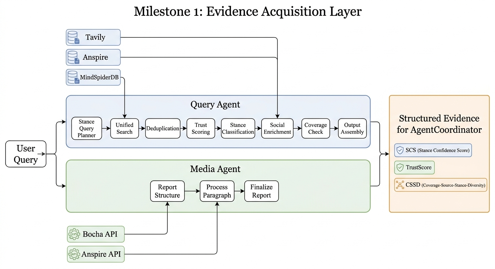
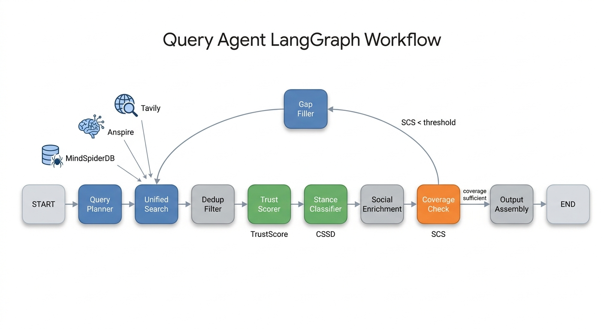
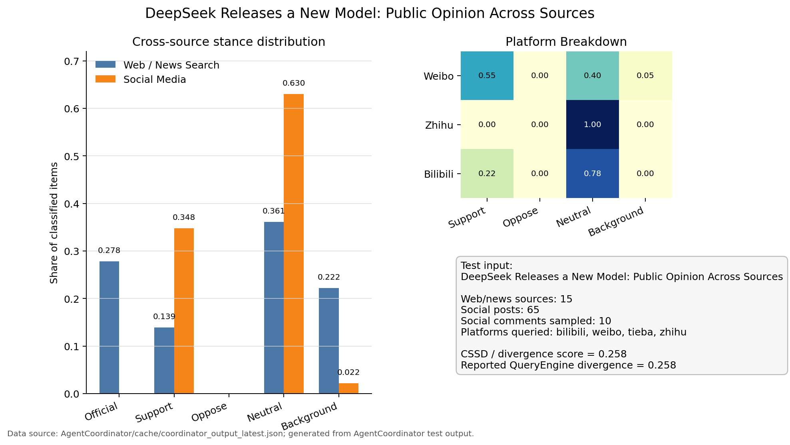

# Milestone 1 Progress Report: Query Agent and Media Agent

> Project: Multi-Agent Public Opinion Analysis System  
> Programme Context: Computer Science Capstone Project, The University of Hong Kong  
> Milestone Scope: Query Agent, Media Agent, MindSpider social-media data integration, and single-agent UI integration  
> Reporting Period: Early April 2026 to Early May 2026  
> Document Purpose: This document records the first major engineering milestone of the capstone project for progress review, supervisor discussion, and later dissertation writing.

---

## 1. Team Contribution Summary

| Team Member | GitHub / Identifier | Main Responsibilities in Milestone 1 | Main Deliverables | Contribution Type |
|---|---|---|---|---|
| li_yewen | li_yewen | Overall system architecture setup; Query Agent design and implementation; MindSpider deployment and social-media data integration; evaluation metrics and project documentation | `QueryEngine/graph/`, stance-aware retrieval, TrustScore, RRF fusion, MinHash deduplication, MindSpiderDB integration, `QUERY_AGENT_SUMMARY.md`, `QUERY_ENGINE_PHASE3.md` | Architecture, backend agent implementation, data engineering, evaluation |
| MIAO Mengyu | mmy0302 | Query Agent development support; English interface/documentation; deduplication improvement | authority-priority deduplication logic, English Query Agent UI, `QUERY_AGENT_SUMMARY_EN.md` | UI, documentation, retrieval quality improvement |
| Crazyheartedddd | Crazyheartedddd | Media Agent LangGraph implementation; UI internationalisation work across Media/Forum/app components | `MediaEngine/graph/`, Media Agent graph nodes, broader UI English interface work | Media Agent architecture, UI integration |
| kzy1234 | kzy1234 | Application integration and Media Agent interface adaptation; text processing utility extraction | `app.py` integration, `SingleEngineApp/media_engine_streamlit_app.py` adaptation, `MediaEngine/utils/text_processing.py`, configuration fixes | Full-stack integration, maintainability improvement |
| Roselia-penguin | Roselia-penguin | README and project progress maintenance | README progress link and project tracking updates | Documentation and project management support |

**Contribution interpretation.** Milestone 1 delivered two reusable agent components from the project design: a structured Query Agent for stance-aware web/social retrieval, and a LangGraph-based Media Agent for Chinese media/multimodal-oriented analysis. This milestone established the data foundation required by later coordination and reporting stages.

---

## 2. Milestone Objective

The objective of Milestone 1 was to build the project's evidence acquisition layer so that the system could produce high-quality, structured, and traceable intermediate evidence before final report generation.

At the beginning of implementation, the evidence acquisition layer was specified as two independent agents: one for web/social retrieval and one for media-oriented analysis. To support a capstone project focused on multi-agent intelligence and public opinion analysis, the following design challenges had to be addressed:

| Design Challenge | Impact on System | Milestone 1 Implementation |
|---|---|---|
| Query retrieval had no stance awareness | Search results could overrepresent one dominant narrative and miss opposition, official, neutral, or background sources | Introduced stance-matrix query planning with official/support/oppose/neutral/background dimensions |
| Search results lacked source reliability modelling | Low-quality sources could be treated as equal to authoritative sources | Introduced TrustScore with domain authority, timeliness, content quality, and RRF relevance |
| No robust deduplication | Repeated syndicated articles inflated evidence volume | Added URL exact deduplication and MinHash LSH near-duplicate filtering; later improved with authority-priority retention |
| Query loop required evidence-driven stopping criteria | Inefficient search would occur without a measurable coverage signal | Added Stance Coverage Score (SCS) and conditional gap-filling loop |
| Web/news evidence was disconnected from social-media sentiment | Public reactions on Weibo/Zhihu/Bilibili were not part of the structured evidence layer | Integrated MindSpiderDB and added social sentiment, comments, trend, and cross-source divergence metrics |
| Media Agent required an explicit and maintainable execution graph | A clear node/state structure was needed for debugging, extension, and downstream coordination | Implemented Media Agent as a LangGraph graph with explicit nodes and state |
| UI and reports were inconsistent across languages | Harder to present to international reviewers | Added English UI and documentation updates |

---

## 3. System Position of Milestone 1

Milestone 1 covers the evidence acquisition layer. Its outputs are consumed by later coordination and report-generation modules.

*Figure 1. Milestone 1 evidence acquisition layer. The Query Agent and Media Agent process the user query in parallel, connect to their respective search and data sources, and produce structured evidence for later AgentCoordinator consumption.*

---

## 4. Query Agent: Technical Progress

### 4.1 Architecture Change

The Query Agent was implemented as a LangGraph-based state machine for structured search, classification, enrichment, and output assembly.

| Component | Role |
|---|---|
| `QueryEngine/graph/state.py` | Defines the structured runtime state and output schema |
| `QueryEngine/graph/builder.py` | Builds the LangGraph workflow and coverage-based conditional routing |
| `query_planner.py` | Produces stance-aware sub-queries |
| `unified_search.py` | Executes multi-source retrieval across Tavily, Anspire, and MindSpider |
| `dedup_filter.py` | Removes exact and near-duplicate results |
| `trust_scorer.py` | Computes source reliability score |
| `stance_classify.py` | Classifies source stance |
| `social_enrichment.py` | Adds MindSpider social-media evidence and CSSD comparison |
| `coverage_check.py` | Computes Stance Coverage Score and decides whether to stop or continue |
| `gap_filler.py` | Generates targeted follow-up sub-queries for missing stance coverage |
| `output_assemble.py` | Produces structured `QueryAgentOutput` |

*Figure 2. Query Agent LangGraph workflow. The graph performs stance-aware planning, multi-source search, deduplication, trust scoring, stance classification, social enrichment, and coverage-based routing. If stance coverage is insufficient, the workflow loops through Gap Filler before returning to Unified Search.*

### 4.2 Core Innovations

**Stance-aware retrieval.** Query planning now explicitly targets five stance categories: official, support, oppose, neutral, and background. This reduces single-perspective evidence bias at the retrieval stage rather than trying to repair bias after retrieval.

**TrustScore.** Each source is scored using a weighted model:

| Factor | Weight | Purpose |
|---|---:|---|
| Domain authority | 0.30 | Prefer institutional, official, and recognised media domains |
| Timeliness | 0.25 | Prefer recent sources for public opinion topics |
| Content quality | 0.25 | Prefer richer snippets/full text over thin results |
| RRF relevance | 0.20 | Preserve search-rank relevance after multi-source fusion |

**Adaptive termination.** The Query Agent no longer runs a fixed number of reflection rounds. It computes Stance Coverage Score (SCS); if stance diversity is insufficient, the graph routes to `gap_filler` for targeted supplementary search.

**Social-media enrichment.** MindSpiderDB adds native platform evidence from Weibo, Zhihu, Bilibili and other crawled sources. This creates a dual-layer analysis: media narrative versus public discussion.

---

## 5. MindSpider Social-Media Integration

MindSpider is treated as a local social-media evidence layer rather than an external search API. Query Agent probes data availability, decides whether social data is available/stale/disabled, and then enriches the final output when data exists.

| Feature | Implementation | Value |
|---|---|---|
| Platform probing | Lightweight count/freshness query | Avoids unnecessary DB and LLM calls when no data exists |
| Post-level stance classification | Hybrid rule/LLM classification | Captures support, opposition, neutrality, and background discussion |
| Comment sentiment aggregation | Cross-table comment search and classification | Adds deeper user reaction beyond top-level posts |
| Temporal sentiment tracking | Date-bucketed social posts | Shows whether sentiment is rising, falling, or stable |
| Cross-source divergence | CSSD = 1 - cosine similarity | Quantifies divergence between web/news and social platforms |
| Graceful degradation | `social_sentiment = null` when unavailable | Keeps Query Agent usable without social data |

*Figure 3. Test result for the input "DeepSeek Releases a New Model: Public Opinion Across Sources". The chart compares the Query Agent's web/news stance distribution with MindSpider social-media stance distribution and shows a platform-level breakdown for Weibo, Zhihu, and Bilibili. The measured CSSD divergence score is 0.258.*

---

## 6. Media Agent: Technical Progress

### 6.1 LangGraph Refactoring

Media Agent was implemented as a LangGraph pipeline:

| Node | Responsibility |
|---|---|
| `report_structure` | Generate report paragraph structure from the user query |
| `process_paragraph` | Execute media-oriented search and paragraph summarisation |
| `finalize_report` | Assemble final media report |

The graph topology is:

`START -> report_structure -> process_paragraph loop -> finalize_report -> END`

This graph-based implementation improves maintainability, keeps the Media Agent consistent with the Query Agent design, and prepares both agents for downstream orchestration by AgentCoordinator.

### 6.2 Search Capability

MediaEngine supports Bocha and Anspire search backends. Bocha is positioned as the multimodal-oriented search provider, while Anspire provides AI search over Chinese web/media content.

| Capability | Current Status | Notes |
|---|---|---|
| Chinese media search | Implemented | Uses Bocha/Anspire search APIs |
| Structured report generation | Implemented | Produces Media Agent Markdown output |
| LangGraph orchestration | Implemented | Explicit state and node routing |
| Text processing extraction | Implemented | `MediaEngine/utils/text_processing.py` improves maintainability |
| Full image/video semantic use | Partial | MediaEngine still mainly consumes textual search results; deeper modal-card parsing remains a future gap |

---

## 7. Validation Evidence

### 7.1 Query Agent Evaluation Dimensions

| Validation Target | Evidence Used | Result / Current State |
|---|---|---|
| Multi-source retrieval | Tavily + Anspire + MindSpiderDB | Implemented and integrated into `unified_search` |
| Stance coverage | SCS and gap-filler routing | Implemented; supports adaptive search loop |
| Source reliability | TrustScore and authority-priority dedup | Implemented |
| Social-media integration | MindSpider platform tables | Implemented; supports post/comment/trend features |
| Structured output | `QueryAgentOutput` JSON | Implemented for downstream Coordinator use |
| UI validation | Streamlit Query Agent UI | Implemented and English-enabled |

### 7.2 Example Test Case

Test topic used during development: `Public opinion on the release of a new DeepSeek model`.

| Metric | Observed Value / Behaviour |
|---|---|
| Social mode | available |
| Platforms covered | Weibo, Zhihu, Bilibili |
| Social posts | 65 in the documented AgentCoordinator test output |
| Comments | 10 sampled social comments |
| CSSD | 0.258 in the documented AgentCoordinator test output |
| Web stance pattern | More official/background oriented, with neutral and support evidence |
| Social stance pattern | More neutral and more support-oriented, with limited background content |

These results show why Milestone 1 matters: the system can now expose a measurable difference between media narratives and platform-level social reactions rather than merging everything into one undifferentiated summary.

---

## 8. Gap Analysis After Milestone 1

| Remaining Gap | Severity | Why It Matters | Planned Resolution in Later Milestone |
|---|---|---|---|
| Query and Media outputs were still separate | High | Final report could still become a concatenation of two reports rather than a reasoned synthesis | Introduce AgentCoordinator for evidence bridging, divergence matrix, deliberation and synthesis |
| ForumEngine file-bus coordination was shallow | High | Log polling cannot represent structured multi-agent reasoning | Replace or supplement with LangGraph Coordinator state machine |
| MediaEngine multimodal data was underused | Medium | Images/videos/cards are not deeply interpreted | Parse modal cards and preserve structured media metadata |
| ReportEngine could not directly consume structured QueryAgentOutput | High | Structured evidence was at risk of being flattened into Markdown | Define coordinator output schema and ReportEngine bridge |
| Evaluation was mostly functional, not fully quantitative | Medium | Harder to compare performance over many topics | Add standard query sets, structured metrics and reproducible benchmark logs |

---

## 9. Deliverables Completed in Milestone 1

| Deliverable | Repository Location | Status |
|---|---|---|
| Query Agent LangGraph implementation | `QueryEngine/graph/` | Completed |
| Stance classifier and TrustScore components | `QueryEngine/classifiers/` | Completed |
| RRF and deduplication utilities | `QueryEngine/fusion/` | Completed |
| MindSpider search client | `QueryEngine/tools/mindspider_search.py` | Completed |
| Query evaluation files | `QueryEngine/evaluation/` | Completed |
| Media Agent LangGraph implementation | `MediaEngine/graph/` | Completed |
| Media text processing utility | `MediaEngine/utils/text_processing.py` | Completed |
| Query Agent English summary | `QUERY_AGENT_SUMMARY_EN.md` | Completed |
| Phase 3 MindSpider documentation | `QUERY_ENGINE_PHASE3.md` | Completed |
| Query and Media Streamlit apps | `SingleEngineApp/` | Completed / integrated |

---

## 10. Milestone 1 Conclusion

Milestone 1 established the project's evidence acquisition foundation. The main engineering achievement was implementing Query Agent and Media Agent as modular, graph-based agents with structured outputs. Query Agent introduced stance-aware retrieval, reliability scoring, adaptive coverage checking, and social-media enrichment. Media Agent was implemented as a LangGraph pipeline, making it compatible with the later coordinator architecture.

The remaining problem after Milestone 1 was not data collection, but reasoning over heterogeneous evidence. Query Agent and Media Agent could each produce useful outputs, but the system still lacked a principled mechanism to compare, challenge, reconcile, and report across agents. This gap directly motivated Milestone 2: AgentCoordinator and Report Agent integration.
