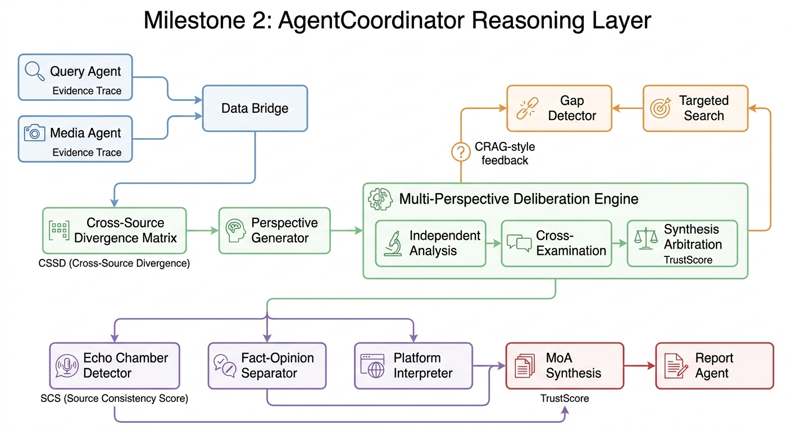
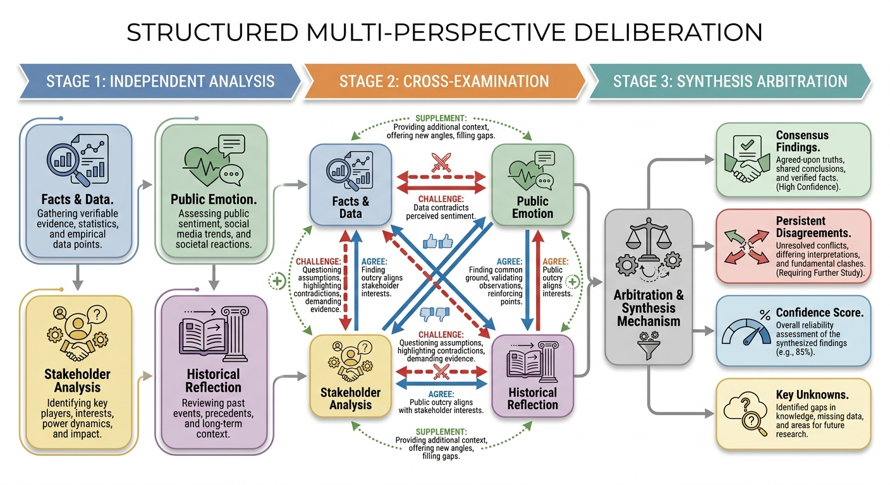
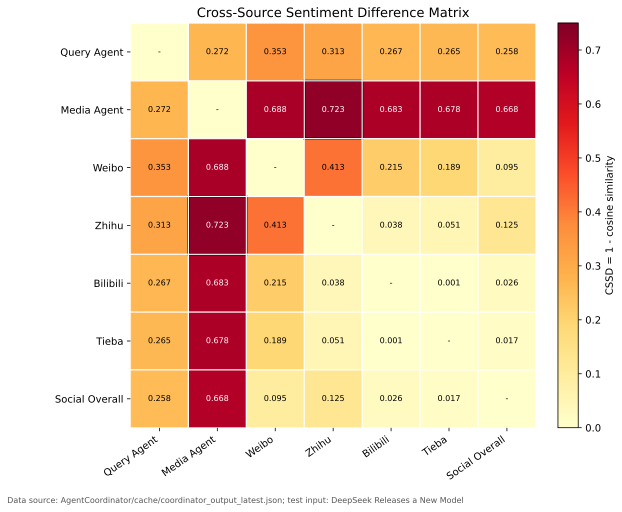

# Milestone 2 Progress Report: AgentCoordinator and Report Agent

> Project: Multi-Agent Public Opinion Analysis System  
> Programme Context: Computer Science Capstone Project, The University of Hong Kong  
> Milestone Scope: AgentCoordinator, multi-agent deliberation, cross-source divergence, fact-opinion separation, structured report handoff, and Report Agent alignment  
> Reporting Period: May 2026  
> Document Purpose: This document records the second major engineering milestone of the capstone project for progress review, supervisor discussion, and dissertation preparation.

---

## 1. Team Contribution Summary

| Team Member | GitHub / Identifier | Main Responsibilities Relevant to Milestone 2 | Main Deliverables | Contribution Type |
|---|---|---|---|---|
| li_yewen | li_yewen | AgentCoordinator architecture, multi-perspective deliberation design, CRAG-style gap filling, divergence matrix, echo chamber detection, fact-opinion separation, coordinator output schema, academic report generator | `AgentCoordinator/`, `coordinator_output_schema.py`, `academic_report_generator.py`, deliberation/synthesis/fact separation prompts, coordinator cache/export mechanism | Architecture, agent orchestration, reasoning layer, report evidence design |
| MIAO Mengyu | mmy0302 | Query Agent improvements and English documentation that provide structured input evidence for Coordinator; UI/documentation consistency | Query Agent English UI and docs, authority-priority dedup support | Evidence quality and presentation support |
| Crazyheartedddd | Crazyheartedddd | Media Agent graph implementation and UI English conversion, enabling Coordinator to call Media Agent through a cleaner interface | `MediaEngine/graph/`, Media UI/internationalisation contributions | Media Agent integration support |
| kzy1234 | kzy1234 | Application-level integration, configuration fixes, Media Agent interface adaptation | `app.py`, MediaEngine Streamlit adaptation, config fixes | Integration and operational support |
| Roselia-penguin | Roselia-penguin | Project progress documentation support | README progress updates | Documentation support |

**Contribution interpretation.** Milestone 2 builds on the agents completed in Milestone 1. It focuses on the central intelligence layer: how to coordinate heterogeneous evidence, preserve disagreement, identify bias, and generate a traceable report suitable for academic and decision-support settings.

---

## 2. Motivation and Gap from Milestone 1

At the end of Milestone 1, the project had two capable analysis agents, but their outputs were still independent. A high-quality public opinion analysis system requires more than concatenating Query Agent and Media Agent reports. It must reason about conflicts between sources, identify data gaps, preserve genuine disagreement, and distinguish facts from opinions.

| Gap After Milestone 1 | Why It Was a Problem | Milestone 2 Solution |
|---|---|---|
| Query Agent and Media Agent outputs were heterogeneous | One produced structured JSON, the other produced Markdown-like media report text | Added `data_bridge_node` to normalize evidence into `BridgedProposition` |
| No formal cross-source disagreement measure | Reports could mention disagreement qualitatively but not quantify it | Added Cross-Source Sentiment Difference (CSSD) matrix |
| No multi-perspective reasoning protocol | A single LLM synthesis could collapse disagreement into a generic summary | Added Multi-Perspective Deliberation Engine with independent analysis, cross-examination, and synthesis arbitration |
| No corrective feedback loop from Coordinator to retrieval | If evidence was missing, the final report could only note the absence | Added CRAG-style gap detection and targeted search loop |
| No explicit bias or echo chamber assessment | Platform skew and silent-majority problems could be ignored | Added entropy-based echo warning and silent-majority hypothesis handling |
| Facts and opinions were mixed | Reports risked presenting sentiment as verified fact | Added fact-opinion-framework separation layer |
| ReportEngine lacked a clean structured handoff | Coordinator outputs could be flattened or lost before final report generation | Added coordinator output schema and ReportEngine bridge |

---

## 3. AgentCoordinator Architecture

AgentCoordinator is the central orchestration layer. It is not a simple glue module. Its role is to transform separate agent outputs into an evidence-traced, disagreement-aware, and bias-aware synthesis.



*Figure 1. AgentCoordinator reasoning layer. Query Agent and Media Agent outputs are normalised through the Data Bridge, compared by the divergence matrix, processed through multi-perspective deliberation and gap filling, then passed through bias/fact-opinion analysis before final synthesis and reporting.*

---

## 4. Implementation Summary

### 4.1 Main Directory

| File / Directory | Responsibility |
|---|---|
| `AgentCoordinator/coordinator.py` | Unified entry point, checkpoint/thread handling, result export |
| `AgentCoordinator/graph/builder.py` | LangGraph state-machine construction |
| `AgentCoordinator/graph/state.py` | Coordinator state definition |
| `AgentCoordinator/graph/nodes/query_agent_node.py` | Calls Query Agent with timeout and cache support |
| `AgentCoordinator/graph/nodes/media_agent_node.py` | Calls Media Agent or injects test data when configured |
| `AgentCoordinator/graph/nodes/data_bridge_node.py` | Converts heterogeneous agent outputs into unified propositions |
| `AgentCoordinator/graph/nodes/divergence_matrix_node.py` | Computes CSSD pairwise divergence matrix |
| `AgentCoordinator/graph/nodes/perspective_generator.py` | Selects analysis perspectives based on topic type |
| `AgentCoordinator/graph/nodes/deliberation_engine.py` | Performs independent analysis, cross-examination, and synthesis arbitration |
| `AgentCoordinator/graph/nodes/gap_detector.py` | Routes to targeted search when evidence gaps remain |
| `AgentCoordinator/graph/nodes/targeted_search_node.py` | Performs supplementary search |
| `AgentCoordinator/graph/nodes/echo_chamber_detector.py` | Detects narrow stance distributions and potential bias |
| `AgentCoordinator/graph/nodes/fact_opinion_separator.py` | Separates verified facts, opinions/sentiments, and analytical frameworks |
| `AgentCoordinator/graph/nodes/platform_interpreter.py` | Provides platform-aware interpretation |
| `AgentCoordinator/graph/nodes/synthesis_node.py` | Produces final MoA-style synthesis context |
| `AgentCoordinator/graph/nodes/report_agent_node.py` | Generates final academic Markdown report |
| `AgentCoordinator/coordinator_output_schema.py` | Defines stable JSON output schema for Report Agent consumption |
| `AgentCoordinator/academic_report_generator.py` | Deterministic evidence-traced academic report generator |
| `AgentCoordinator/utils/report_bridge.py` | Adapter from Coordinator output to ReportEngine inputs |

### 4.2 LangGraph Flow

The implemented graph follows this high-level pipeline:

1. **Parallel agent execution**: Query Agent and Media Agent run from the same user query.
2. **Data bridging**: Different output formats are converted into a unified proposition representation.
3. **Divergence computation**: CSSD is calculated across source pairs and platform pairs.
4. **Perspective generation**: Topic type controls which analytical perspectives are used.
5. **Structured deliberation**: Multiple perspectives analyse, challenge, and synthesize evidence.
6. **Gap detection and targeted search**: Missing evidence can trigger a corrective retrieval loop.
7. **Bias and fact correction**: Echo chamber detection and fact-opinion separation improve reliability.
8. **Synthesis and report generation**: Final output is assembled into structured JSON and academic-style Markdown / ReportEngine handoff.

---

## 5. Core Technical Contributions

### 5.1 Multi-Perspective Deliberation Engine

The deliberation engine avoids a common weakness of LLM reports: a single model summarises everything into one smooth narrative. Instead, the Coordinator simulates structured multi-perspective reasoning.

| Phase | Purpose | Output |
|---|---|---|
| Independent Analysis | Each perspective analyses the evidence independently | Perspective-specific arguments, evidence, confidence, data gaps |
| Cross-Examination | Perspectives agree, challenge, or supplement each other | Revised positions, emerging consensus, persistent disagreement |
| Synthesis Arbitration | A final synthesis preserves both consensus and unresolved tension | Consensus findings, persistent disagreements, confidence, unknowns |

This makes the report more transparent: readers can see not only the final conclusion, but also where uncertainty and disagreement remain.



*Figure 2. Structured multi-perspective deliberation. Independent perspective analysis is followed by cross-examination and synthesis arbitration, producing consensus findings, persistent disagreements, confidence assessment, and unresolved unknowns.*

### 5.2 Cross-Source Divergence Matrix

CSSD is used to compare stance distributions between source groups.

```text
CSSD(A, B) = 1 - cosine_similarity(stance_vector_A, stance_vector_B)
```

| CSSD Range | Interpretation |
|---:|---|
| 0.0-0.1 | Nearly identical |
| 0.1-0.3 | Low divergence |
| 0.3-0.6 | Moderate divergence |
| 0.6-0.8 | High divergence |
| 0.8-1.0 | Extreme divergence |



*Figure 3. Cross-source sentiment difference matrix generated from `AgentCoordinator/cache/coordinator_output_latest.json`. In the documented DeepSeek test output, the highest divergence is between Zhihu and Media Agent (CSSD = 0.7226), while the lowest divergence is between Bilibili and Tieba (CSSD = 0.0010).*

### 5.3 CRAG-Style Gap Filling

The Coordinator can detect evidence gaps after deliberation. If gaps are important and the maximum search round has not been reached, the graph routes to `targeted_search_node`, retrieves supplementary results, and returns to deliberation.

This shifts the system from one-shot retrieval to corrective retrieval, which is more suitable for complex public opinion topics where missing evidence can change conclusions.

### 5.4 Echo Chamber and Bias Detection

The Coordinator checks whether the retrieved evidence is overly concentrated in one stance or platform. It can produce echo warnings and silent-majority hypotheses. This does not claim to fully solve sampling bias, but it makes limitations explicit in the final report.

### 5.5 Fact-Opinion-Framework Separation

The report layer separates:

| Layer | Meaning | Example |
|---|---|---|
| Verified facts | Claims supported by identifiable sources | release date, official statement, benchmark number |
| Opinions and sentiments | Public or platform-level attitudes | supportive, sceptical, neutral discussion |
| Analytical frameworks | Higher-level interpretation | technical, economic, historical, sociological, political |

This separation is important for public opinion analysis because social sentiment should not be presented as factual evidence unless it is clearly labelled as sentiment.

---

## 6. Report Agent and Output Alignment

### 6.1 Coordinator Output Schema

A stable `coordinator_output.json` schema was introduced so that the final report stage can consume structured results reliably.

Major fields include:

| Field | Purpose |
|---|---|
| `divergence_matrix` | Pairwise CSSD values and hotspots |
| `deliberation` | Perspectives, phases, consensus, and dissents |
| `gap_filling` | Search gaps and supplementary results |
| `platform_interpretations` | Platform-aware interpretation text |
| `bias_analysis` | Echo warnings and silent-majority hypothesis |
| `fact_opinion_separation` | Verified facts, opinions, and analytical frameworks |
| `synthesis` | Final summary, insights, tensions, confidence, follow-up items |
| `source_data` | Query Agent and Media Agent source summaries |
| `coordinator_trace` | Execution trace for reproducibility |

### 6.2 Academic Report Generator

A deterministic report generator converts Coordinator output into an academic-style Markdown report. It avoids additional LLM hallucination at the final fallback stage and preserves traceability.

Report sections include:

1. Abstract
2. Introduction and Background
3. Methodology and Metrics
4. Data Overview
5. Findings
6. Multi-Perspective Deliberation
7. Bias Assessment and Information Integrity
8. Conclusions and Implications
9. Appendices with source list, CSSD values, and coordinator trace

### 6.3 ReportEngine Adapter

A ReportEngine bridge was added so Coordinator output can be passed into ReportEngine's existing `generate_report()` interface. The adapter constructs:

```python
{
    "query": str,
    "reports": [query_engine_report, media_engine_report],
    "forum_logs": str,
    "custom_template": str,
    "metadata": dict,
}
```

The bridge preserves structured JSON inside the evidence package and uses an English report template for Coordinator handoff.

---

## 7. Validation Evidence

### 7.1 End-to-End Coordinator Test Case

Development test topic: `Public opinion on the release of a new DeepSeek model`.

Documented result from the implementation notes:

| Module / Metric | Value |
|---|---:|
| QueryAgent source count | 45 |
| QueryAgent coverage score | 1.00 |
| Divergence matrix sources | 6 |
| Divergence matrix pairs | 15 |
| Divergence hotspots | 11 |
| Deliberation perspectives | 4 |
| Deliberation consensus points | 7+ |
| Deliberation dissent points | 6+ |
| Verified facts | 4+ |
| MoA synthesis confidence | around 0.70-0.72 |
| Generated report mode | Academic Markdown fallback / ReportEngine handoff supported |

### 7.2 Current Regression Tests

The following tests were run after the latest Report Agent alignment work:

```bash
UV_CACHE_DIR=/tmp/uv-cache MPLCONFIGDIR=/tmp/mpl-cache uv run python -m py_compile AgentCoordinator/utils/report_bridge.py AgentCoordinator/utils/__init__.py AgentCoordinator/graph/nodes/report_agent_node.py ReportEngine/prompts/prompts.py ReportEngine/agent.py tests/test_coordinator_report_bridge.py tests/test_report_engine_sanitization.py

UV_CACHE_DIR=/tmp/uv-cache MPLCONFIGDIR=/tmp/mpl-cache uv run python -m unittest tests.test_coordinator_report_bridge

UV_CACHE_DIR=/tmp/uv-cache MPLCONFIGDIR=/tmp/mpl-cache uv run python -m unittest tests.test_report_engine_sanitization
```

Observed result:

| Test | Result |
|---|---|
| Python syntax compilation | Passed |
| `tests.test_coordinator_report_bridge` | 5 tests passed |
| `tests.test_report_engine_sanitization` | 6 tests passed |

---

## 8. Gap Analysis After Milestone 2

| Remaining Gap | Severity | Explanation | Proposed Next Step |
|---|---|---|---|
| Full Report Agent HTML generation depends on LLM/API configuration | Medium | The deterministic academic report works locally, but full Report Agent HTML output requires configured report-generation LLM keys | Add documented evaluation configuration and a no-network sample output mode |
| Chinese ReportEngine templates remain in template library | Medium | Coordinator handoff uses English custom template, but general ReportEngine template selection may still pick Chinese templates | Translate or duplicate key templates into English |
| Media Agent still underuses true multimodal content | Medium | The Media Agent primarily processes text even when search APIs return image/video/modal-card metadata | Add modal-card parser and structured image/video evidence fields |
| Quantitative evaluation is not yet systematic across many topics | High for dissertation | Current validation is based on representative topics and functional tests | Build a benchmark set of 20-50 topics with coverage, diversity, factuality, latency, and report-quality metrics |
| Human evaluation is not yet documented | Medium | Supervisor/reviewer may ask whether reports are useful to users | Add small-scale human evaluation rubric: factuality, clarity, usefulness, traceability |
| UI-level integration of Coordinator reports can be improved | Medium | Backend pipeline is stronger than the current front-end display of deliberation and CSSD | Add visual panels for divergence heatmap, deliberation timeline, and source trace |

---

## 9. Milestone 2 Conclusion

Milestone 2 transformed the project from a set of independent analysis agents into an integrated multi-agent reasoning system. AgentCoordinator now bridges Query Agent and Media Agent outputs, measures cross-source divergence, performs structured deliberation, identifies gaps, detects bias, separates facts from opinions, and produces a traceable synthesis for reporting.

The main academic contribution of this milestone is not simply adding another pipeline layer. It introduces a reasoning protocol for public opinion analysis: retrieve diverse evidence, compare source disagreement, preserve uncertainty, correct gaps, and generate evidence-traced reports. This directly addresses the core weakness left after Milestone 1: independent agents could collect information, but they could not yet reason together in a transparent and academically defensible way.
