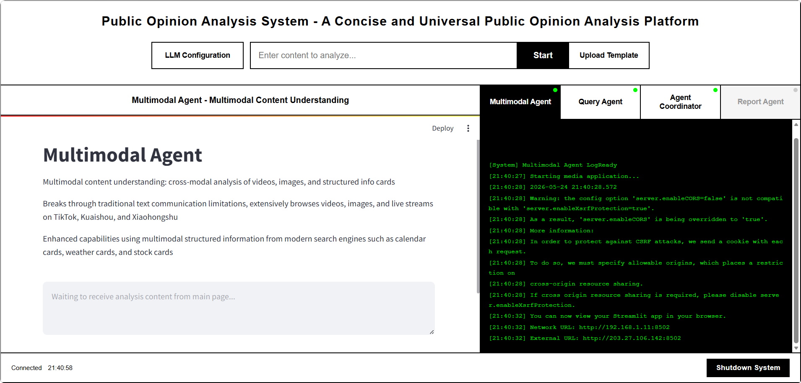
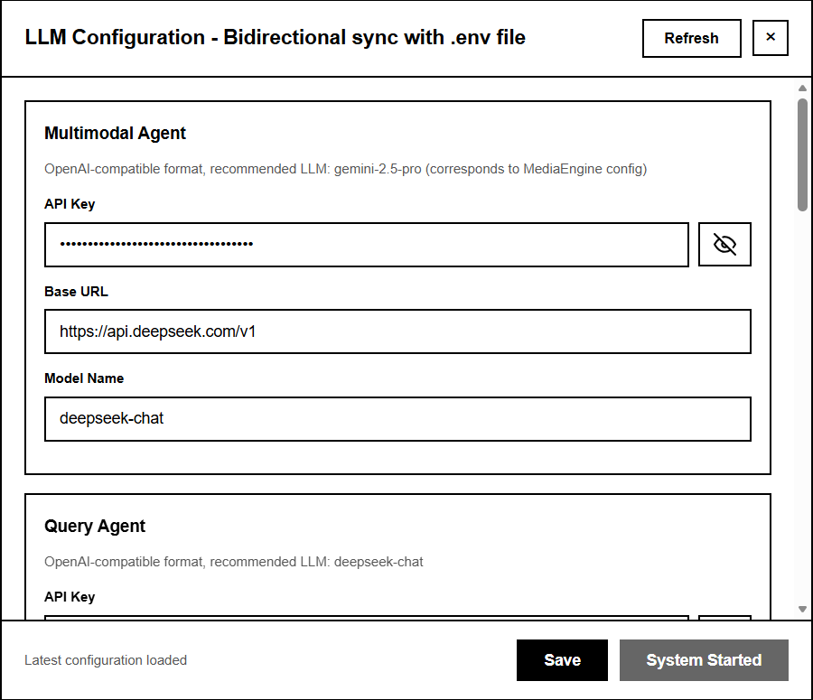
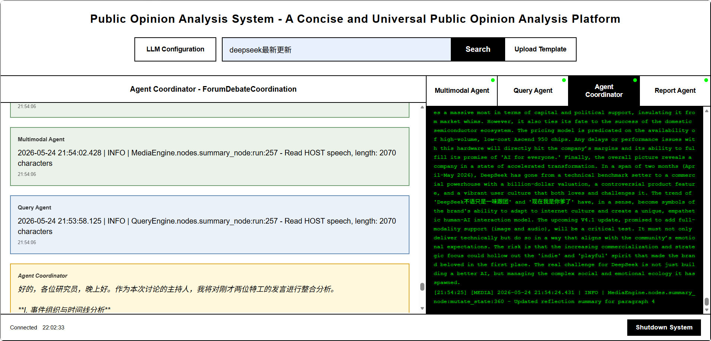
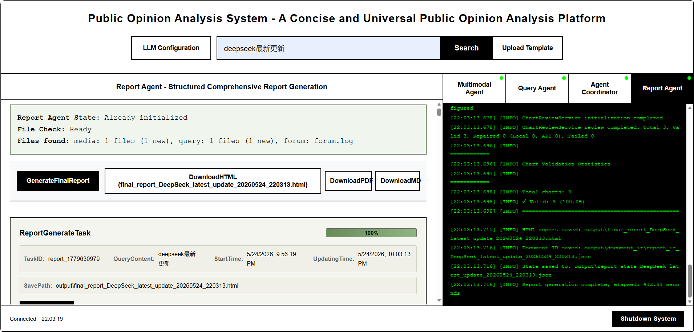
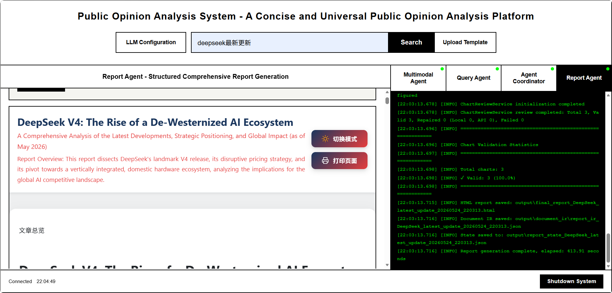

# 5.3. 临时前端与集成进展

> 负责人: Miao (mmy0302)
> 范围: 统一控制面板、Streamlit 子应用嵌入、实时日志控制台、LLM 配置面板、ForumEngine 集成、ReportEngine 桥接
> 状态: 临时前端功能完整 —— 所有核心工作流均已打通

---

## 5.3.1. 概述

当前前端是一个**临时但功能完整的集成层**，基于 Flask + 原生 HTML/CSS/JS + Socket.IO 构建。它承担三个核心职责：

1. **统一控制面板** —— 单页仪表盘，在一个 URL 下承载所有子系统
2. **运行时配置** —— 与 `.env` 双向同步，无需重启即可修改 API Key 和模型设置
3. **实时可观测性** —— 通过 WebSocket 实时流式传输所有子进程的控制台输出

> **"临时"指 UI 风格极简（黑白 brutalist 风格），而非功能缺失。** 从启动系统、执行搜索、查看 Agent 输出，到生成报告、下载结果，每一条控制流都已端到端打通。

---

## 5.3.2. 架构

```
┌─────────────────────────────────────────────────────────┐
│  浏览器 (http://localhost:5000)                          │
│  ┌───────────────────────────────────────────────────┐  │
│  │  index.html  (Flask 渲染的控制面板)                │  │
│  │  ┌─────────┐ ┌─────────┐ ┌──────┐ ┌──────────┐   │  │
│  │  │ 搜索框  │ │ 配置    │ │ 应用 │ │ 控制台   │   │  │
│  │  │ + 上传  │ │ 弹窗    │ │ 切换 │ │ 输出     │   │  │
│  │  │         │ │ (.env)  │ │ 标签 │ │ (实时)   │   │  │
│  │  └─────────┘ └─────────┘ └──────┘ └──────────┘   │  │
│  │  ┌────────────────────────────────────────────┐   │  │
│  │  │  嵌入内容区 (iframe)                        │   │  │
│  │  │  ┌──────────┐ ┌──────────┐ ┌────────────┐  │   │  │
│  │  │  │ Media    │ │ Query    │ │ Forum /    │  │   │  │
│  │  │  │ Agent    │ │ Agent    │ │ Report     │  │   │  │
│  │  │  │ :8502    │ │ :8503    │ │ 预览       │  │   │  │
│  │  │  └──────────┘ └──────────┘ └────────────┘  │   │  │
│  │  └────────────────────────────────────────────┘   │  │
│  └───────────────────────────────────────────────────┘  │
│  Socket.IO ── 实时日志流                                  │
└─────────────────────────────────────────────────────────┘
                          │
           Flask app.py (端口 5000)
           ├── Streamlit 子进程: Media Agent (:8502)
           ├── Streamlit 子进程: Query Agent (:8503)
           ├── ForumEngine 后台线程
           └── ReportEngine Blueprint (/api/report/*)
```

---

## 5.3.3. 功能详解

### 5.3.3.1. 主控制面板 (Flask index.html)

**地址:** `http://localhost:5000`

首页为单页应用 (SPA)，包含以下功能区：

| 区域 | 说明 |
|---|---|
| **搜索栏** | 文本输入 + 开始按钮。输入关键词触发 Media Agent / Query Agent 执行分析。支持上传自定义报告模板（`.md`、`.txt`）。 |
| **LLM 配置** | 模态弹窗，直接读写 `.env` 文件。系统停止状态下可修改所有 API Key、Base URL 和模型名称。保存后即时持久化到磁盘。 |
| **应用切换标签** | 四个标签页 —— Media Agent、Query Agent、Forum、Report —— 切换嵌入视图和控制台日志。状态指示灯显示各子系统运行（绿色）/ 停止（红色）。 |
| **嵌入内容区** | Streamlit 子应用通过 `<iframe>` 嵌入（Media :8502, Query :8503），Forum 聊天和 Report 预览使用原生 HTML 容器。 |
| **控制台输出** | 实时日志面板，通过 Socket.IO 流式展示所有子进程的 `stdout`/`stderr`。每条日志标注来源应用。 |
| **系统控制** | 配置弹窗中的「保存并启动系统」一键启动所有子系统。「关闭系统」按钮优雅终止所有子进程。 |
| **状态栏** | 底部栏显示 WebSocket 连接状态和系统时间。 |

*(截图：主控制面板全貌，四个标签页和控制台输出均可见)*

### 5.3.3.2. LLM 配置面板

**入口:** 点击主页「LLM Configuration」按钮。

- 通过 `GET /api/config` 从后端 `.env` 文件读取当前配置
- 按类别展示所有 LLM 设置字段（各 Agent 的 API Key、Base URL、模型名称）
- API Key 字段默认密码掩码显示，提供眼睛图标切换可见性
- 「Save」通过 `POST /api/config` 写回 `.env` 文件
- 「Save & Start System」保存配置并启动所有子进程
- 系统运行期间配置弹窗锁定（禁止自动保存），防止热重载导致的问题

*(截图：配置弹窗打开状态，API Key 字段已填充)*

### 5.3.3.3. Streamlit 子应用嵌入

Flask 管理两个 Streamlit 子进程：

**Media Agent** (`:8502` — `media_engine_streamlit_app.py`)
- 多模态内容理解（视频、图片、结构化信息卡）
- 广泛爬取抖音、快手、小红书等平台
- 通过 Bocha API 或 Anspire API 进行搜索（可在 `.env` 切换）
- 输出：Streamlit UI 中嵌入图表的分析报告

**Query Agent** (`:8503` — `query_engine_streamlit_app.py`)
- 基于 Tavily API 的网络搜索
- 基于 DeepSeek 的舆情分析推理
- 输出：带来源引用的结构化分析报告

两个应用均通过 `<iframe>` 嵌入主面板，可通过应用标签切换。点击标签页加载对应 iframe，同时将控制台日志源切换为该应用的输出。

### 5.3.3.4. ForumEngine 集成

ForumEngine 是后台运行的智能多 Agent 讨论论坛：

- **论坛聊天区** —— 主面板中的原生 HTML 容器，展示 Agent 间对话
- **论坛日志** —— `logs/forum.log` 被尾部追踪并通过 Socket.IO 流式推送到前端
- **参与者** —— 主持人 (Host)、Query Agent、Media Agent 以结构化对话格式交换分析结果
- 消息从日志行解析（时间戳、来源、内容）并渲染为聊天气泡

*(截图：论坛聊天界面，Agent 对话可见)*

### 5.3.3.5. ReportEngine 桥接

两个分析 Agent 完成工作后：

- **Report 标签页**解锁
- 「Generate Final Report」按钮触发 `POST /api/report/generate`
- 状态消息显示逐章生成进度
- 生成完成后，下载按钮激活：
  - **Download HTML** —— 完整交互式报告
  - **Download PDF** —— 服务端 WeasyPrint 渲染的 PDF
  - **Download MD** —— 原始 Markdown 源文件
- 报告预览在 iframe 中渲染生成的 HTML

*(截图：报告预览界面，下载按钮已激活)*

### 5.3.3.6. 实时控制台与日志

- 页面加载时建立 Socket.IO 连接（`socket.io.js` CDN）
- 每个子进程输出行以 `console_output` 事件发送，携带 `{app, line}` 负载
- 每个应用的控制台输出维护在内存缓冲区（单应用最多 200 行）
- 切换标签页刷新控制台以显示所选应用的日志
- 日志同步写入磁盘：`logs/media.log`、`logs/query.log`、`logs/forum.log`

---

## 5.3.4. 集成状态矩阵

| 集成点 | 状态 | 详情 |
|---|---|---|
| Flask 编排器 ↔ Streamlit 子进程 | 已完成 | 子进程管理，含健康检查、端口冲突解决、优雅关闭 |
| 前端 ↔ 后端配置同步 | 已完成 | 通过 REST API 双向 `.env` 读写 |
| 前端 ↔ 子进程日志 | 已完成 | Socket.IO 实时流，每应用独立日志缓冲 |
| 前端 ↔ ForumEngine | 已完成 | 日志解析 + 聊天渲染 |
| 前端 ↔ ReportEngine | 已完成 | 生成 + 下载（HTML/PDF/MD） |
| 跨域 iframe 嵌入 | 已完成 | Streamlit 以 `--server.enableCORS false` 启动以允许嵌入 |
| 系统生命周期 | 已完成 | 一键启动全部、一键关闭全部、通过 API 单应用重启 |

---

## 5.3.5. 已知局限（临时性说明）

以下局限来自*当前临时前端的实现选择*，而非系统能力的上限：

1. **无鉴权 / 访问控制** —— 配置面板和系统控制对能访问端口 5000 的任何人均开放。本地开发可接受，部署到 localhost 之外前需要登录层。

2. **极简 brutalist 风格** —— UI 采用最简黑白配色加边框布局。无设计系统、无移动端响应式断点。功能完整但视觉未打磨。

3. **无 SPA 框架** —— 前端为原生 HTML/CSS/JS（单文件约 4700 行）。无 React/Vue 组件模型。状态通过全局变量和 DOM 查询管理。当前规模尚可，但长期维护建议迁移至框架。

4. **iframe 嵌入的脆弱性** —— Streamlit 应用通过 iframe 嵌入，意味着：
   - Streamlit 自身的 UI 框架（侧边栏、页眉）仍出现在嵌入视图中
   - 跨域限制需要 `--server.enableCORS false`
   - 切换标签页时 iframe 重新加载，丢失滚动位置

5. **无 PWA 特性** —— 无 Service Worker、离线支持或推送通知。

6. **单文件 HTML** —— 整个前端在 `templates/index.html` 中（约 1600 行 CSS + 约 3100 行 JS）。开发阶段为快速迭代刻意保持单文件结构。

---

## 5.3.6. 为什么是「临时」的？

| 原因 | 规划 |
|---|---|
| 开发速度 | 单文件原生前端允许快速集成测试，无框架 overhead |
| API 优先设计 | Flask REST API + Socket.IO 层是稳定的契约；前端只是可独立替换的消费者 |
| 未来迁移路径 | API 接口（`/api/config`、`/api/system/start`、`/api/system/shutdown`、`/api/report/*`、Socket.IO 事件）已明确定义，可被 React/Vue SPA 消费而无需后端改动 |
| 当前里程碑需求 | 现有 UI 足以支撑导师演示、集成测试和毕业设计答辩 |

---

## 5.3.7. 启动方式

```bash
# 1. 配置 .env（至少需要: ANSPIRE_API_KEY 或 BOCHA_WEB_SEARCH_API_KEY）
cp .env.example .env
# 编辑 .env 填入你的 API Key

# 2. 安装依赖
pip install -r requirements.txt
python -m playwright install chromium

# 3. 启动系统
python app.py

# 4. 打开浏览器
# 主面板:         http://localhost:5000
# Media Agent:    http://localhost:8502
# Query Agent:    http://localhost:8503
```

---

## 5.3.8. 截图

> **截图指南:** 在 `python app.py` 运行状态下，用浏览器打开 `http://localhost:5000`。以下每小节描述具体的截图状态。

### 5.3.8.1. 主控制面板

系统完全启动后（三个状态指示灯均为绿色）打开 `http://localhost:5000`，截图包含：
- 顶部搜索栏，显示 "Enter content to analyze..." 占位文字
- "LLM Configuration" 按钮和模板上传图标
- 四个应用切换标签：Media Agent / Query Agent / Forum / Report
- 嵌入内容区显示默认的 Media Agent Streamlit iframe
- 底部控制台输出面板显示启动日志
- 状态栏显示 "Connected" 和当前时间

### 5.3.8.2. LLM 配置弹窗

点击 "LLM Configuration" 按钮打开弹窗：
- 展示所有 API Key 字段（密码掩码）及切换可见性的眼睛图标
- 各 Agent 的 Base URL 和模型名称字段
- 底部 "Refresh"、"Save"、"Save & Start System" 按钮
- 弹窗标题 "Bidirectional sync with .env file"

### 5.3.8.3. Media Agent 嵌入视图

切换到 "Media Agent" 标签页：
- Streamlit 应用嵌入在主面板的 iframe 中
- 显示 "Multimodal Agent" 标题和功能描述
- Streamlit UI 中的搜索输入区域

### 5.3.8.4. Query Agent 嵌入视图

切换到 "Query Agent" 标签页：
- Streamlit 应用嵌入在主面板的 iframe 中
- 显示 "Query Agent" 标题和功能描述
- Streamlit UI 中的网络搜索配置区域

### 5.3.8.5. 论坛聊天

切换到 "Forum" 标签页：
- 聊天风格界面展示多 Agent 对话
- 来自 Host、Query Agent、Media Agent 的消息，按来源标注颜色
- 控制台面板同步切换到论坛日志输出

### 5.3.8.6. 报告生成

完成一轮完整分析后，切换到 "Report" 标签页：
- 引擎状态块显示连接状态
- "Generate Final Report" 主按钮
- 下载按钮：HTML、PDF、MD（生成后激活）
- 报告预览 iframe 显示渲染后的 HTML 报告
- 任务进度区域位于预览上方

### 5.3.8.7. 控制台输出

在任意标签页下，滚动查看底部控制台面板：
- 带时间戳的彩色日志行
- 每条日志标注来源：`[media]`、`[query]` 或 `[forum]`
- 分析进行中时可见实时流式输出

### 5.3.8.8. 完整工作流序列

截取一系列截图展示端到端工作流：
1. 输入搜索查询并点击 "Start"
2. Media Agent 在嵌入视图中产出结果
3. Query Agent 在嵌入视图中产出结果
4. Forum 标签页显示 Agent 讨论
5. Report 标签页显示最终生成的报告，下载按钮已激活
