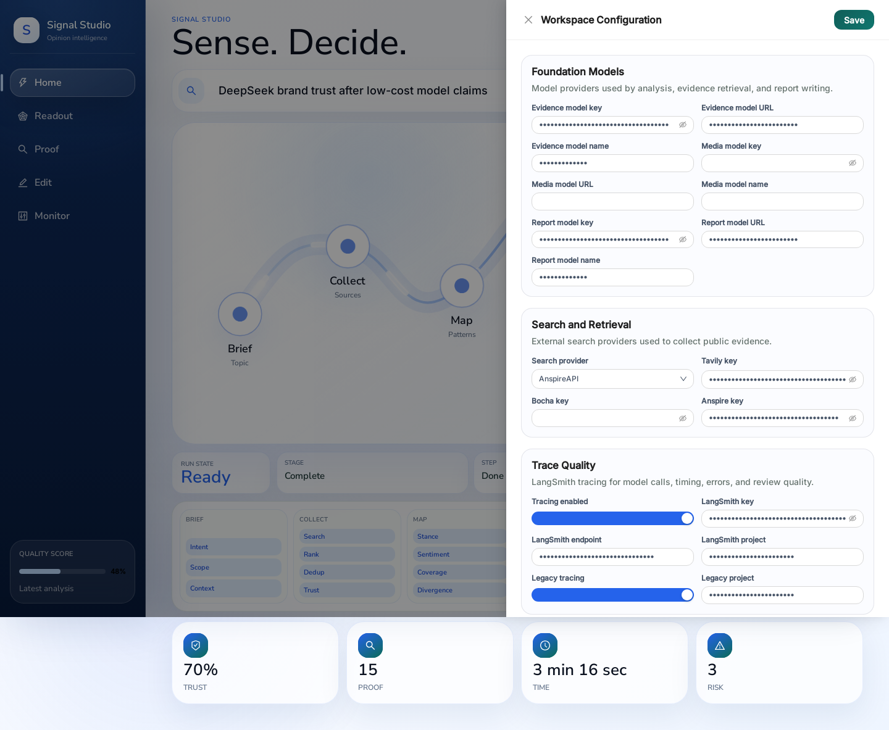
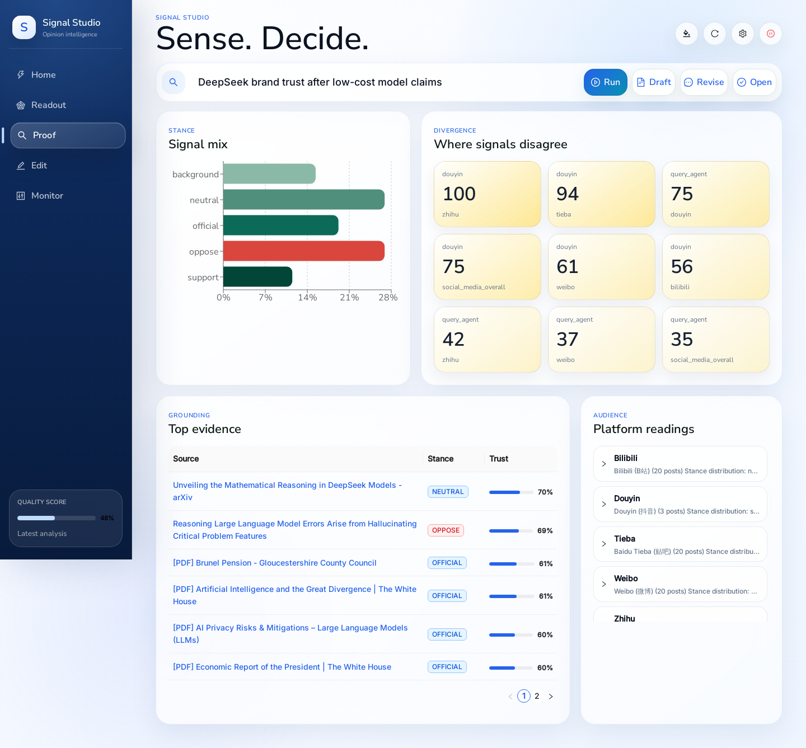
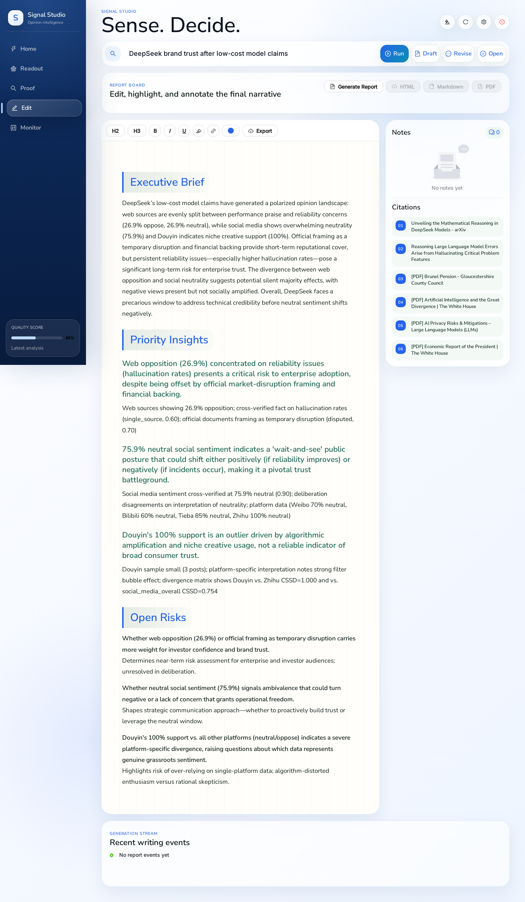
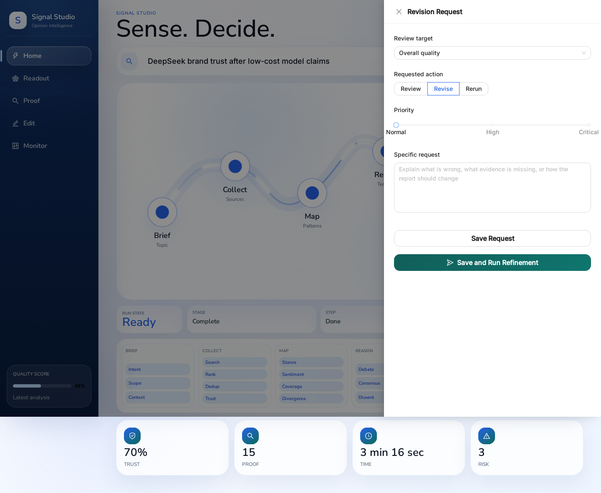

# Signal Studio 最终页面使用指南

> 适用页面: Flask + React 最终演示页面
> 访问地址: `http://localhost:5000`
> 本文用途: 给第一次使用页面的同学说明页面有哪些区域、怎么操作、会生成什么，以及如何理解结果。

## 1. 使用前先确认

启动后端:

```bash
.venv/bin/python app.py
```

浏览器打开:

```text
http://localhost:5000
```

本页面会自动读取最近一次完整分析产物:

- 最新分析文件: `AgentCoordinator/cache/coordinator_output_latest.json`
- 本次示例主题: `DeepSeek brand trust after low-cost model claims`
- 本次缓存结果: 总体置信度 `70%`，证据来源 `15` 个，社媒帖子约 `1607` 条，覆盖 `douyin / bilibili / weibo / tieba / zhihu` 五个平台
- 已生成报告示例: `output/final_report_DeepSeek_brand_trust_after_low_20260612_005634.html`

注意: `Run` 和 `Draft` 都会触发真实后台任务，可能调用外部搜索和大模型，耗时较长。只是学习页面时，优先看自动加载的 latest 结果，不要反复点击这两个按钮。

## 2. 首页: 看当前任务和进入功能区


首页主要分成四块:

| 区域 | 作用 | 怎么看 |
|---|---|---|
| 左侧导航 | `Home / Readout / Proof / Edit / Monitor` | 用来切换分析总览、证据、报告编辑和运行监控 |
| 顶部按钮 | 主题、刷新、设置、关闭 | 刷新会重新读取 latest 结果；设置用于填 API Key；关闭用于停止当前工作区服务 |
| Topic 输入框 | 输入新的分析主题 | 输入后点击 `Run` 才会重新跑分析 |
| 中间流程图 | 展示 Brief、Collect、Map、Reason、Verify、Write 六步 | 有 latest 结果时整条流程会显示完成；运行中会显示实时阶段 |

底部几个圆形指标可以快速判断当前分析质量:

- `Trust`: 综合置信度，本次为 `70%`
- `Proof`: 证据来源数量，本次为 `15`
- `Time`: 上一次流水线耗时，本次约 `3 min 16 sec`
- `Risk`: 系统识别出的关键风险数量，本次为 `3`

首页命令栏按钮含义:

| 按钮 | 会做什么 | 使用建议 |
|---|---|---|
| `Run` | 按当前 Topic 重新运行 AgentCoordinator 完整分析 | 需要确认 API Key 和搜索配置后再点 |
| `Draft` | 基于当前 latest 分析生成正式报告 | 会启动 ReportEngine，可能很慢 |
| `Revise` | 打开修改意见抽屉 | 只保存意见不会重跑；选择保存并重跑才会启动新任务 |
| `Open` | 有 latest 结果时跳到 Readout | 推荐先用它查看已有结果 |

## 3. 配置: 第一次运行前填 Key



点击右上角齿轮按钮打开 `Workspace Configuration`。

配置分三组:

| 分组 | 需要理解什么 |
|---|---|
| `Foundation Models` | Query、Media、Report 三类 Agent 使用的大模型 API Key、Base URL 和模型名 |
| `Search and Retrieval` | 搜索工具类型，以及 Tavily / Bocha / Anspire 等搜索 Key |
| `Trace Quality` | LangSmith 追踪配置，用于在 Monitor 页查看模型调用链路 |

常用操作:

1. 填好或修改 API Key。
2. 点击右上角 `Save`，只保存配置。
3. 如果准备真实运行，点击底部 `Save and Start Runtime`，保存并初始化运行时。

配置会写入项目根目录 `.env`。不要把 `.env`、`cookie.txt` 或任何真实 Key 提交到 GitHub。

## 4. Readout: 看结论和风险


进入 `Readout` 后，先看三类内容:

- `Signal`: 当前最重要的综合判断。它来自多个 Agent 的综合推理，不是单条搜索结果。
- `Watch`: 系统认为需要重点关注的风险或争议点。
- `Priority Insights`: 排序后的关键洞察，每条右侧的圆环表示该洞察置信度。

本次示例可以这样理解:

- DeepSeek 低成本模型声明带来两面影响: 成本和性能叙事有正面价值，但可靠性和幻觉率问题会影响企业信任。
- 社交媒体整体偏中性，说明大众尚未形成强烈态度；这既是修复信任的窗口，也可能在负面事件后快速转向。
- 抖音样本显示强支持，但系统把它判断为平台特异性结果，不能直接代表全网信任。

点击 `Details` 可以打开更完整的 Readout 说明和推荐后续调查方向。

## 5. Proof: 看证据、立场和平台差异



`Proof` 页用来回答“这些结论从哪里来、不同平台是否一致”。

| 模块 | 怎么看 |
|---|---|
| `Signal mix` | 不同立场占比。support 是支持，oppose 是反对，neutral 是中性，official 是官方/机构来源 |
| `Where signals disagree` | 平台差异热力图。数值越高，说明两个平台观点差异越大 |
| `Top evidence` | 证据表，包含来源标题、立场标签和信任分数 |
| `Platform readings` | 每个平台的文字解释，说明平台用户结构和算法偏差 |

本次示例中，`douyin vs zhihu` 差异最高，说明短视频平台的支持性样本和知乎的中性分析之间存在明显分裂。解读结果时不要只看单个平台，要结合热力图和证据表。

## 6. Edit: 生成、编辑和导出报告



`Edit` 页是报告工作台。页面分为三部分:

| 区域 | 作用 |
|---|---|
| 顶部按钮 | `Generate Report` 触发报告生成；HTML / Markdown / PDF 用于下载生成结果 |
| 中间编辑器 | 可以直接改报告正文、加标题、加粗、斜体、下划线、高亮、引用链接 |
| 右侧面板 | `Notes` 保存批注，`Citations` 展示来自 Query Agent 的引用来源 |

编辑器工具栏:

- `H2 / H3`: 把选中文本变成二级或三级标题
- `B / I / U`: 加粗、斜体、下划线
- 高亮图标: 标记重点句
- 链接图标: 给选中文本添加来源 URL
- `Export`: 导出当前编辑器里的 HTML

如果需要正式报告:

1. 确认首页已经加载 latest 分析，或先完成一次 `Run`。
2. 进入 `Edit`。
3. 点击 `Generate Report` 或首页的 `Draft`。
4. 等待 `Generation stream` 出现完成事件。
5. 完成后下载 `HTML / Markdown / PDF`。

报告生成会使用 ReportEngine，耗时通常比查看 latest 结果更长。

## 7. 批注: 给报告或结果提修改意见



点击首页命令栏的 `Revise`，会打开 `Revision Request` 抽屉。

字段含义:

| 字段 | 说明 |
|---|---|
| `Review target` | 选择要反馈的对象，比如总体质量、证据支撑、报告叙事、风险解释 |
| `Requested action` | `Review` 是只审阅，`Revise` 是要求修改，`Rerun` 是希望重新运行 |
| `Priority` | Normal / High / Critical |
| `Specific request` | 写清楚哪里不对、缺什么证据、希望如何改 |

底部两个按钮区别:

- `Save Request`: 只保存反馈记录，不重新跑模型。
- `Save and Run Refinement`: 保存反馈后立即重新运行分析，会触发完整后台任务。

建议先用 `Save Request` 记录意见；只有确实需要新结果时，再用 `Save and Run Refinement`。

## 8. Monitor: 看运行状态和追踪


`Monitor` 用来确认系统是否真的在跑、跑到哪一步、有没有错误。

| 模块 | 作用 |
|---|---|
| `Run Replay` | 展示 Coordinator 当前或最近一次任务的阶段回放 |
| `Latest Analysis` | 展示当前 latest 产物质量、来源数、置信度、耗时、错误数 |
| `LangSmith Traces` | 如果配置了 LangSmith，可以看模型调用、耗时、错误和 token 成本 |
| `Revision Requests` | 显示已保存的修改意见 |
| `Artifact` | 显示 latest 产物更新时间、归档数量、格式版本和追踪来源 |

如果页面看起来没有更新，先点 Monitor 页或右上角刷新按钮。若后台任务正在跑，不要重复点击 `Run` 或 `Draft`。

## 9. 一次完整真实运行会生成什么

点击 `Run` 后，Coordinator 会产生或更新:

```text
AgentCoordinator/cache/coordinator_output_YYYYMMDD_HHMMSS.json
AgentCoordinator/cache/coordinator_output_latest.json
```

其中 `coordinator_output_latest.json` 是 React 页面默认读取的 latest 结果。

点击 `Draft` 或 `Generate Report` 后，ReportEngine 会产生:

```text
output/final_report_<topic>_<timestamp>.html
output/report_state_<topic>_<timestamp>.json
output/document_ir/report_ir_<topic>_<timestamp>.json
output/chapters/<report-id>/
```

页面上的 `HTML / Markdown / PDF` 下载按钮对应 ReportEngine 当前任务产物。编辑器里的 `Export` 只导出你当前手工编辑后的 HTML。

## 10. 安全操作建议

为了避免页面卡住或后台重复跑任务:

1. 第一次打开页面时，先看已有 latest 结果，不要马上点 `Run`。
2. 真实重跑前，先在 Settings 里确认 API Key 和搜索工具配置。
3. 点击 `Run` 后去 Monitor 等进度，不要连续点击。
4. 点击 `Draft` 后等待 `Generation stream`，报告生成期间不要刷新或重复提交。
5. 如果只是记录问题，用 `Save Request`，不要用 `Save and Run Refinement`。
6. 如果要停止当前工作区，点右上角关闭按钮，再确认 `Shut Down`。

## 11. 本次验证截图清单

| 截图 | 文件 |
|---|---|
| 首页和流程总览 | `docs/figures/signal-studio-home.png` |
| Readout 结论页 | `docs/figures/signal-studio-readout.png` |
| Proof 证据页 | `docs/figures/signal-studio-proof.png` |
| Edit 报告编辑页 | `docs/figures/signal-studio-edit.png` |
| Monitor 运行监控页 | `docs/figures/signal-studio-monitor.png` |
| Settings 配置抽屉 | `docs/figures/signal-studio-settings.png` |
| Revision Request 修改意见抽屉 | `docs/figures/signal-studio-revise.png` |
